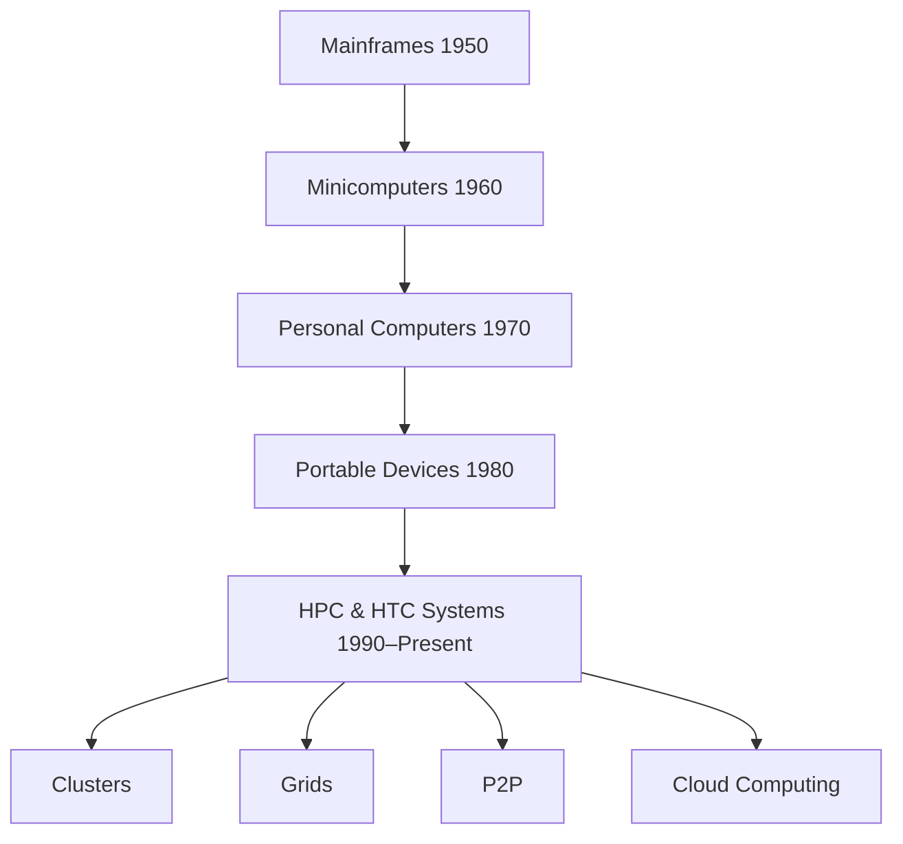

# BIS613D – Cloud Computing and Security
## Module 1: Distributed System Models and Enabling Technologies
### Complete Question Bank + In-Depth Answers + Importance Ranking

**Syllabus coverage (Textbook 1, Chapter 1: 1.1 to 1.5):**
Scalable Computing Over the Internet · Technologies for Network-Based Systems · System Models for Distributed and Cloud Computing · Software Environments for Distributed Systems and Clouds · Performance, Security and Energy Efficiency.

**Source papers analysed (5 documents):**

| Code | Paper | Notes |
|------|-------|-------|
| **A** | Model Question Paper-1/2 (CBCS) | *Model_Solved.pdf* + *Model_Paper.pdf* are the **same paper** (one solved, one blank) |
| **B** | Make-Up Exam, June/July 2025 | *Makeup__1_.pdf* |
| **C** | Regular Exam, June/July 2025 | *June_July.pdf* |
| **D** | Internal Assessment Test No. 01 | *WhatsApp_Scheme.pdf* (Scheme of Evaluation) |

> Because documents 2 and 3 are identical, there are effectively **4 distinct question papers**. This matters for the repetition ranking at the end.

---

## PART 1 — All Module 1 Questions Extracted

### Paper A — Model Question Paper (Q.01 / Q.02, Module-1)
| # | Question | Marks | Bloom |
|---|----------|-------|-------|
| A1 | Explain the **Platform Evolution** of different computer technologies with a neat diagram | 10 | L2 |
| A2 | Outline **eight reasons to adapt the cloud** for upgraded Internet applications and web services | 8 | L2 |
| A3 | Briefly explain **Message Passing Interface (MPI)** | 2 | L2 |
| A4 | Summarize **VM Primitive Operations** with relevant diagram | 10 | L2 |
| A5 | Illustrate various **system attacks and network threats** to cyberspace, resulting in **4 types of losses**, with a neat diagram | 10 | L2 |

### Paper B — Make-Up Exam, June/July 2025 (Q.1 / Q.2, Module-1)
| # | Question | Marks | Bloom |
|---|----------|-------|-------|
| B1 | Explain **scalable computing over the internet** | 10 | L2 |
| B2 | Discuss **Internet of Things and cyber-physical systems** | 10 | L2 |
| B3 | Discuss **system models for distributed and cloud computing** | 10 | L2 |
| B4 | Explain **performance, security and energy efficiency** | 10 | L2 |

### Paper C — Regular Exam, June/July 2025 (Q.1 / Q.2, Module-1)
| # | Question | Marks | Bloom |
|---|----------|-------|-------|
| C1 | Describe the **vision introduced by cloud computing** | 6 | L2 |
| C2 | Provide brief **characteristics of a distributed system** with examples | 6 | L3 |
| C3 | What is the major **revolution introduced by Web 2.0**? | 8 | L2 |
| C4 | Describe the main characteristic of **service orientation** of cloud computing with examples | 6 | L3 |
| C5 | What is the major **distributed computing technology that led to cloud computing**? | 6 | L2 |
| C6 | Briefly summarize the **challenges still open in cloud computing** | 8 | L1 |

### Paper D — Internal Test No. 01 (Module-1 portions only)
| # | Question | Marks | Bloom |
|---|----------|-------|-------|
| D1 | Explain various **technologies enabling network-based distributed systems** | 10 | L2 |
| D2 | Describe the **architecture of cloud computing systems** | 10 | L2 |
| D3 | Explain **system models for distributed and cloud computing** with neat diagrams | 10 | L2 |
| D4 | Illustrate the **performance, energy efficiency, and security** in scalable computing | 10 | L2 |

*(Test No. 01 also asked virtualization-level, Hyper-V, full/para-virtualization and cloud-architecture-design questions — these belong to Modules 2 and 3 and are excluded here.)*

---

## PART 2 — In-Depth Answers

> Each answer is written to the depth implied by its marks and is cross-checked against the **evaluation scheme** (Doc D), which shows how examiners split marks (e.g. a 10-mark architecture question is awarded 5 M for the description + 5 M for the diagram/second sub-section).

---

### A1 / (relates to B1, C1, C5). Platform Evolution of Computer Technologies — *10 marks*

**Core idea:** Computer technology has passed through **five generations**, each lasting **10–20 years**, with a roughly **10-year overlap** between successive generations (transitions were gradual, not sudden).

**The five generations:**

1. **Mainframe Era (1950–1970)** – Large, centralized machines for big businesses and governments. Examples: **IBM 360, CDC 6400**. Limited, centralized access.
2. **Minicomputer Era (1960–1980)** – Lower-cost, more interactive systems for smaller businesses and colleges. Examples: **DEC PDP-11, VAX series**.
3. **Personal Computer (PC) Era (1970–1990)** – Rise of PCs built with **VLSI microprocessors**; widespread use in homes, schools, offices.
4. **Portable Devices Era (1980–2000)** – Growth of **laptops, PDAs, wireless devices**; enabled **mobility and ubiquitous computing**.
5. **HPC & HTC Era (1990–present)** – **High-Performance Computing (HPC)** and **High-Throughput Computing (HTC)** delivered through **clusters, grids, and cloud computing**; used in both scientific and commercial web-scale applications.

**Current trends:** Web-based shared resources and big data dominate; expensive **MPP supercomputers are being replaced by clusters of homogeneous nodes**; HTC systems emphasize **P2P sharing and cloud/web services**.

**Diagram 1 — Generation timeline:**


**Diagram 2 — Figure 1.1 (evolutionary trend, two converging branches):**
- **HTC branch:** HTC systems → (file sharing, distributed control) → **P2P network** → (geographically sparse) → Computational & data grids → SOA → **Web 2.0 services / Internet clouds**.
- **HPC branch:** HPC systems → (high speed, centralized control) → **Clusters or MPPs** → (disparate clusters) → grids → (RFID & sensors) → **Internet of Things**.
- Both branches converge on **Internet clouds via virtualization**.

---

### B1. Scalable Computing Over the Internet — *10 marks*

Instead of using one centralized computer, a **parallel and distributed computing system uses multiple computers to solve large-scale problems over the Internet**. Distributed computing thus becomes **data-intensive and network-centric**. Cover these sub-topics:

**1. The age of Internet computing & platform evolution** — see A1 (the five generations).

**2. HPC → HTC shift:**
- **HPC** focuses on **raw speed** (Gflops in the 1990s → Pflops by the 2010s); traditional MPP supercomputers are replaced by **clusters of cooperative computers**.
- **HTC** focuses on **high task throughput** for millions of users (Internet searches, web services). HTC addresses not just speed but **cost, energy efficiency, security and reliability**.

**3. Computing paradigm distinctions:** centralized, parallel, distributed, cloud, ubiquitous (IoT) and Internet computing.

**4. Degrees of parallelism:** BLP (bit-level) → ILP (instruction-level) → DLP (data-level / SIMD) → TLP (task-level) → JLP (job-level). Coarse-grained parallelism builds on fine-grained.

**5. Driving laws:** **Moore's Law** (processor speed doubles ~every 18 months); **Gilder's Law** (network bandwidth doubles each year); plus cheap commodity hardware.

**6. Shift to utility computing:** pay-per-use model; cloud extends it to edge networks. Challenges: efficient network processors, scalable storage/memory, virtualization middleware, new programming models.

**7. Design objectives** of future HPC/HTC systems: **Efficiency, Dependability, Adaptability, Flexibility**.

---

### A2 / (relates to C1, C6). Eight Reasons to Adapt the Cloud — *8 marks*

For upgraded Internet applications and web services, eight motivating reasons:

1. **Desired location** — data centers in **protected space with higher energy efficiency**.
2. **Sharing peak-load capacity** among a large pool of users → **improved overall utilization**.
3. **Separation of infrastructure maintenance** from domain-specific **application development**.
4. **Significant cost reduction** compared with traditional computing paradigms.
5. **Cloud programming and application development** support.
6. **Service and data discovery** and **content/service distribution**.
7. **Privacy, security, copyright and reliability** issues handled at scale.
8. **Service agreements, business models, and pricing policies** (flexible, pay-as-you-go).

**Diagram:** a simple vertical flow of the eight boxes (1 → 2 → … → 8).

---

### A3. Message Passing Interface (MPI) — *2 marks*

- A **standard library** that allows **communication between multiple processes** in parallel computing.
- Commonly used in **supercomputers and clusters** for high-performance tasks.
- Processes work **independently** and exchange data through **message passing**.
- Key functions: **`MPI_Send`** and **`MPI_Recv`** to send and receive messages.

*(In the broader notes, MPI sits beside MapReduce and Hadoop as a parallel/distributed programming model — MPI for HPC, MapReduce/Hadoop for big-data HTC.)*

---

### A4. VM Primitive Operations — *10 marks*

**Setup:** The **VMM (Virtual Machine Monitor / hypervisor)** presents a virtual-machine view to the guest OS. With **full virtualization**, the VM looks exactly like a real machine, so standard OSes (Windows, Linux) run as if on actual hardware. Mendel Rosenblum described the low-level VMM operations (Figure 1.13).

**The four primitive operations:**

| Op | Figure | Meaning |
|----|--------|---------|
| **(a) Multiplexing** | 1.13(a) | A VM is **multiplexed (shared)** between different physical hardware machines |
| **(b) Suspension** | 1.13(b) | A VM is **paused/suspended and saved to stable storage** |
| **(c) Provision (resume)** | 1.13(c) | A suspended VM is **resumed or provisioned** onto a new hardware platform |
| **(d) Live migration** | 1.13(d) | A VM is **migrated** from one hardware machine to another |

**Diagram (Figure 1.13) layout:**
```
(a) Multiplexing        (b) Suspension
 [App|OS]                 [App|OS] --> saved to Storage
 [VMM ][VMM]              [VMM]
 [HW  ][HW ]              [HW]

(c) Provision/resume    (d) Live migration
 Storage --> [App|OS]     [App|OS] ==> [App|OS]
            [VMM]         [VMM]        [VMM]
            [HW]          [HW]         [HW]
```

**Benefits:**
- VMs run on **any available hardware platform**.
- **Easy to move** distributed applications.
- **Better server-resource utilization**; many server functions on one machine.
- Avoids **server sprawl** (too many physical servers).
- VMware claims utilization rises from **5–15% to 60–80%**.

---

### A5 / (security part of B4, D4). System Attacks, Network Threats & the 4 Types of Losses — *10 marks*

**Context:** Clusters, grids, clouds and P2P systems must be protected to be trusted. Network viruses damage routers/servers; open systems (data centers, P2P) are easy targets; attacks cause large financial losses.

**The four types of losses (Figure 1.25):**

| Loss type | Result | Caused by |
|-----------|--------|-----------|
| **Loss of Confidentiality** | Information leakage | Eavesdropping, traffic analysis, EM/RF interception, indiscretions of personnel, media scavenging |
| **Loss of Integrity** | Integrity violation | Penetration, masquerade, bypassing controls, no authorization, physical intrusion (also intercept/alter, repudiation) |
| **Loss of Availability** | Denial of Service | DoS, Trojan Horse, trapdoor, service spoofing, resource exhaustion, replay |
| **Improper Authentication** | Illegitimate use | Theft, resource exhaustion, integrity violation (attackers gain access without proper rights) |

**Diagram (Figure 1.25):** four top boxes (Information leakage / Integrity violation / Denial of service / Illegitimate use) each fed by the attack lists above.

*(Related defenses — useful add-on: three generations of network security = prevention-based, detection-based, intelligent-response; plus trust negotiation, worm containment, IDS.)*

---

### B2. Internet of Things (IoT) and Cyber-Physical Systems (CPS) — *10 marks*

**Internet of Things (IoT):**
- The traditional Internet connects machines/web pages; **the IoT concept was introduced in 1999 at MIT**.
- The **networked interconnection of everyday objects, tools, devices, or computers** — a **wireless network of sensors** interconnecting all things in daily life.
- Allows objects to be **sensed and controlled remotely** across existing network infrastructure.
- Uses **RFID, GPS, and sensors** for real-time tracking and automation.
- **Supported by Internet clouds** to achieve ubiquitous computing — any object, any place, any time.

**Cyber-Physical Systems (CPS):**
- A CPS **merges computation, communication, and control (the "3C")** to create intelligent systems.
- Bridges **virtual (cyber) and physical world interactions**.

**Significance:** Both IoT and CPS will play a major role in future **cloud computing and smart-infrastructure development**.

*(Tip: mention these sit at the end of the HTC branch of Figure 1.1 — RFID/sensors → IoT.)*

---

### B3 / D3. System Models for Distributed and Cloud Computing — *10 marks*

Distributed and cloud systems are built from **large-scale, interconnected autonomous nodes** linked via **SANs, LANs, or WANs** in a hierarchical manner.

**The four system models:**

| Model | Connectivity / Size | Control | Applications | Representative systems |
|-------|--------------------|---------|--------------|------------------------|
| **Clusters** | Nodes via SAN/LAN/WAN; **hundreds of machines** | Homogeneous, distributed control, UNIX/Linux | HPC, search engines, web services | Google search engine, IBM Road Runner, Cray XT4 |
| **P2P Networks** | Overlay of client machines; **millions of nodes** | Autonomous nodes, self-organizing | File sharing, content delivery, social networking | Gnutella, BitTorrent, Skype, JXTA |
| **Data/Computational Grids** | Heterogeneous clusters via high-speed links; **thousands of computers** | Centralized, server-oriented, authenticated | Distributed supercomputing, global problem solving | TeraGrid, ChinaGrid, EGEE, e-Science Grid |
| **Cloud Platforms** | Virtualized clusters over data centers via SLA | Dynamic resource provisioning | Web search, utility computing, outsourced services | Google App Engine, IBM BlueCloud, AWS, Azure |

**Server Clusters & Interconnection Networks (Figure 1.15):**
- Multiple computers via **high-bandwidth, low-latency** networks (SAN, LAN, InfiniBand); scalable to thousands of nodes.
- Connected to the Internet via a **VPN gateway** that assigns an IP address.
- Each node runs **its own OS → Multiple System Images (MSI)**; cluster shares I/O devices and disk arrays.

**Diagram (Figure 1.15):**
```
        ___________ A Cluster ___________
       | S1  S2 ... S(n-1)  Sn           |
       |   SAN / LAN / NAS (Ethernet,    | --- Gateway --- [ The Internet ]
       |   Myrinet, InfiniBand)          |
       |   S0   [I/O devices][Disk arrays]|
        ----------------------------------
```

**Single-System Image (SSI):** an ideal cluster merges all nodes into one powerful machine via middleware/OS support; without SSI, a cluster is just a collection of independent computers.

> **Scheme note (Doc D):** for this 10-mark question the examiner expects the **four-model description + the Server-Cluster diagram (Fig 1.15)** with the VPN-gateway / MSI / shared-I/O bullet points.

---

### B4 / D4. Performance, Security, and Energy Efficiency — *10 marks*

This is Section 1.5 condensed. Cover all three pillars:

**1. Performance metrics & scalability**
- Measured by **MIPS, Tflops, TPS, and network latency**.
- Four scalability dimensions: **Size, Software, Application, Technology** scalability.
- **Amdahl's Law** (fixed workload): speedup `S = 1 / [α + (1−α)/n]`, limited by the sequential fraction **α**; efficiency `E = S/n = 1/[αn + 1 − α]`.
- **Gustafson's Law** (scaled workload): `S' = α + (1−α)n`; efficiency `E' = α/n + (1−α)`. More efficient for large clusters.
- **Availability** = `MTTF / (MTTF + MTTR)`; eliminate single points of failure with redundancy.

**2. Security (threats & data integrity)**
- The **four types of losses** (see A5): confidentiality, integrity, availability, authentication.
- Cloud security responsibility split by model: **SaaS** (provider handles most), **PaaS** (shared), **IaaS** (user handles most).
- Defenses: prevention → detection → intelligent response.

**3. Energy efficiency**
- **Idle servers** waste energy: **~$3.8 billion/year globally, 11.8 million tons of CO₂**.
- Manage energy across **four layers**: **Application, Middleware, Resource, Network** (Figure 1.26).
- **DVFS (Dynamic Voltage-Frequency Scaling):** lowers CPU voltage/frequency during slack; energy in CMOS circuits `E = C_eff · f · v² · t`. **DPM (Dynamic Power Management)** also used.

> **Scheme note (Doc D):** the marker awards 10 M typically as performance/scalability dimensions + energy section (idle-server figures + 4-layer Figure 1.26). Mentioning Amdahl's/Gustafson's laws strengthens the answer.

---

### D1. Technologies Enabling Network-Based (Distributed) Systems — *10 marks*

This is Section 1.2. Advancements in **multicore CPUs and multithreading** have been crucial to HPC and HTC.

**1. Advances in CPU processors**
- Modern processors integrate **dual/quad/six or more cores** to boost **ILP and TLP**.
- Speed growth follows **Moore's Law**: 1 MIPS (VAX-780, 1978) → 22,000 MIPS (Sun Niagara 2, 2008) → 159,000 MIPS (Intel Core i7 990x, 2011).
- **Clock rates** rose from 10 MHz (Intel 286) to 4 GHz (Pentium 4) but have **stabilized** due to heat/power limits.

**2. Multicore CPU & many-core GPU architectures (Figure 1.5)**
- Each core has a **private L1 cache**, with **shared L2/L3 cache** (or DRAM off-chip).
- **Many-core GPUs** (NVIDIA/AMD) use hundreds–thousands of cores, excelling at **DLP** and graphics.
- **Example: Sun Niagara II** — 8 cores × 8 threads = **64-thread parallelism**.

**Diagram (Figure 1.5):**
```
            Multicore processor
  [Core 1] [Core 2] ... [Core n]
  [L1 ]    [L1 ]        [L1 ]
        \     |        /
            [ L2 cache ]
                |
         [ L3 cache / DRAM ]
```

**3. GPU computing to exascale** — GPGPU (CUDA, Tesla, Fermi); NVIDIA **Fermi = 512 CUDA cores, 82.4 Tflops**. GPUs prioritize **throughput**, CPUs optimize **latency**; GPUs use ~**1/10th power per instruction**; exascale targets **60 Gflops/W per core**.

**4. Multithreading microarchitectures** — superscalar, fine-grained, coarse-grained, **SMT**.

**5. Memory, storage & WAN** — DRAM 4× every 3 years (memory-wall problem); disks 10× every 8 years (3 TB by 2011); SSDs; Ethernet 10 Mbps (1979) → 100 Gbps (2011); LAN/SAN/NAS.

**6. Virtualization & data-center virtualization** — VMs abstract hardware; commodity x86 + Ethernet lower costs; convergence enabling cloud.

> **Scheme note (Doc D):** the marker explicitly split this 10-mark answer as **5 M (Advances in CPU + Figure 1.5)** + **5 M (multicore/many-core trends + key network trends)**.

---

### D2 / C1. Architecture / Vision of Cloud Computing Systems — *10 / 6 marks*

**Cloud computing over the Internet:** an **on-demand computing paradigm** that shifts computation and storage **from desktops to large data centers**, virtualizing hardware, software and data resources.

**Internet clouds (Figure 1.18):**
- Leverage **virtualization** to dynamically provision resources, reducing cost/complexity.
- Offer **elastic, scalable, self-recovering** computing power via server clusters and large databases.
- Can be seen as a **centralized resource pool** *or* a **distributed computing platform**.
- **Key benefits:** cost-effectiveness, flexibility, multi-user application support.

**Diagram (Figure 1.18):**
```
  User --submit requests--> ( Internet Cloud:
                              Hardware | Software | Storage
                              | Network | Service )
```

**Three service models (Figure 1.19):**
- **IaaS** — VMs, storage, networking (e.g., Amazon EC2, Google Compute Engine).
- **PaaS** — development environment, middleware, tools (e.g., Google App Engine, Azure, AWS Lambda).
- **SaaS** — applications via browser (e.g., Google Workspace, Microsoft 365, Salesforce).

**Deployment models:** Private, Public, Hybrid, Managed cloud.

**Vision (for C1, 6 M):** Cloud moves "everything as a service," makes computing a utility (pay-as-you-go), and becomes the backbone of modern Internet/enterprise computing via virtualization, scalability and cost efficiency.

> **Scheme note (Doc D):** marker structured this as the Figure-1.18 cloud diagram + the four benefit bullets + the **three service models** + the cloud landscape (Figure 1.19).

---

### C2. Characteristics of a Distributed System (with examples) — *6 marks*

A **distributed system** consists of **multiple autonomous computers**, each with **private memory**, communicating through a **network via message passing**. Programs running on them are **distributed programs**; writing them is **distributed programming**.

**Characteristics:**
- **Autonomy** — each node is independent with its own OS.
- **No shared memory** — coordination only by **message passing**.
- **Concurrency** — many nodes work in parallel.
- **Scalability** — nodes can be added as workload grows.
- **Resource sharing** — hardware, software and data shared across nodes.
- **Fault tolerance / no global clock** — nodes can fail independently.

**Contrast:** *centralized* (all resources in one machine), *parallel* (tightly/loosely coupled processors with shared/distributed memory), *cloud* (Internet-based, may be centralized or distributed).

**Examples:** computer clusters, computational/data grids, P2P networks, cloud platforms (Google search, BitTorrent, TeraGrid, AWS).

---

### C3. Major Revolution Introduced by Web 2.0 — *8 marks*

Web 2.0 marks the shift from the **static, read-only Web (Web 1.0)** to an **interactive, participatory Web** where users both consume and create content.

**Key revolutionary aspects:**
- **User-generated content & social networking** — wikis, blogs, social platforms, consumer-generated media.
- **Rich interactive services** delivered over the browser (SaaS-style applications).
- **Service-Oriented Architecture (SOA)** — modular, reusable web services that can be composed.
- **Mashups** — combining multiple services/data sources into new applications.
- **Web services & APIs** (SOAP, REST) enabling machine-to-machine integration.

**Impact on cloud:** Web 2.0 services, SOA and mashups are listed among the **converging technologies that enable cloud computing** — they facilitate cloud-based **service integration** and on-demand delivery, paving the way for SaaS and the broader cloud ecosystem.

---

### C4. Service Orientation of Cloud Computing (with examples) — *6 marks*

**Service-Oriented Architecture (SOA)** underpins web services, grids and clouds by enabling **modular, scalable, reusable software components that communicate over a network**.

**Main characteristics:**
- **Loose coupling** — services interact through well-defined interfaces, independent of implementation.
- **Two implementation styles:** **Web Services (SOAP-based)** — fully specified, OS-like environments; **REST** — lightweight, flexible, scalable, suited to fast-evolving web apps.
- **Communication standards:** SOAP, RMI (Java), IIOP (CORBA); middleware (WebSphere MQ, JMS) for messaging/security/fault tolerance.
- **Service integration** via RMI/RPC to compose larger applications.
- **Evolution of SOA (Figure 1.21):** Sensor Services (SS) collect raw data → Filter Services (FS) process it → compute/storage/discovery clouds → transforming **raw data → information → knowledge → wisdom → decisions**.

**Examples / mapping to cloud:** SaaS exposes applications as services; PaaS exposes development services; IaaS exposes infrastructure as a service — all consumed on demand via standard interfaces and SLAs.

---

### C5. Major Distributed Computing Technology that Led to Cloud Computing — *6 marks*

No single technology — cloud emerged from a **convergence**:

1. **Virtualization & multicore processors** — enable scalable, elastic computing (the single most enabling technology).
2. **Utility & grid computing** — provided the pay-per-use, resource-sharing foundation.
3. **SOA, Web 2.0 and mashups** — facilitate cloud-based service integration.
4. **Autonomic computing & data-center automation** — improve efficiency and fault tolerance.

Add: **clusters → grids → P2P** evolution and high-speed networking gave the underlying distributed infrastructure; **virtualization** is the key turning point that made on-demand, multi-tenant clouds possible.

---

### C6. Challenges Still Open in Cloud / Distributed Computing — *8 marks*

From a Module-1 (CO1) standpoint, the open challenges fall into two groups:

**A. Challenges in future parallel & distributed systems:**
1. **Energy & power efficiency** — cut power while raising performance.
2. **Memory & storage bottlenecks** — optimize data movement (memory-wall problem).
3. **Concurrency & locality** — better software/compiler support for parallelism.
4. **System resiliency** — fault tolerance at large scale.

**B. Open cloud-architecture challenges:**
1. **Service availability & data lock-in** — proprietary APIs trap data; multi-provider use improves availability.
2. **Data privacy & security** — DDoS, malware, VM hijacking, cross-border data laws.
3. **Unpredictable performance & I/O bottlenecks** in multi-tenant systems.
4. **Distributed storage & large-scale software bugs** (hard to debug at scale).
5. **Scalability, interoperability & standardization** (e.g., OVF formats, cross-platform migration).
6. **Software licensing & reputation sharing** (pay-per-use licenses; one bad tenant harms all).

*(The "six open challenges" list (B) is detailed in Module 3, but it is the correct content when this question is mapped to cloud computing.)*

---

## PART 3 — Importance Ranking (Most Important → Least)

Ranking logic = **direct repetition across the 4 distinct papers** + **conceptual recurrence** (the same syllabus section asked in different words) + **marks weight**. Remember Papers A's two PDFs are the *same* paper.

| Rank | Topic / Question | Where it appears | Papers | Why it ranks here |
|------|------------------|------------------|--------|-------------------|
| **1** | **System Models for Distributed & Cloud Computing** (Clusters, Grids, P2P, Cloud + Fig 1.15) | **B3, D3** (direct); reinforced by **C2, C5** | 2 direct + 2 related | Asked verbatim in 2 papers and circled by 2 more; full 10-mark, diagram-heavy. **Study first.** |
| **2** | **Performance, Security & Energy Efficiency** (1.5) | **B4, D4** (direct); security half = **A5** | 2 direct + 1 related | Repeated 10-mark question; the security sub-part (4 losses) is itself a separate 10-mark item. |
| **3** | **Scalable Computing Over the Internet / Platform Evolution** (1.1) | **A1** (Platform Evolution), **B1** (Scalable computing) | 2 direct | The whole of Section 1.1 keeps coming back; A1's diagram is a guaranteed-marks staple. |
| **4** | **Cloud Computing — vision, architecture & service models** (1.3.4 / 1.4) | **C1, D2** (direct); supported by **A2, C5** | 2 direct + 2 related | Cloud architecture (Fig 1.18/1.19) + the 8 reasons recur; central to CO1. |
| **5** | **Technologies for Network-Based Systems** (1.2 – CPU/GPU/multicore/memory) | **D1** | 1 direct | Whole section; the internal test explicitly weighted it 5 M + 5 M. High yield, often the "10-marker." |
| **6** | **VM Primitive Operations** (multiplexing/suspend/provision/migrate) | **A4** | 1 direct | Clean 10-mark diagram question (Fig 1.13); easy full marks if memorized. |
| **7** | **System Attacks & 4 Types of Losses** (Fig 1.25) | **A5** | 1 direct (+ part of #2) | Standalone 10-marker and a sub-part of the recurring "security" theme. |
| **8** | **Eight Reasons to Adapt the Cloud** | **A2** | 1 direct | Compact 8-mark list; quick to memorize, supports cloud-vision questions. |
| **9** | **SOA / Web 2.0 / Service Orientation** (1.4) | **C3, C4** | 1 paper (2 Qs) | Two questions but only in one paper; moderate likelihood. |
| **10** | **IoT & Cyber-Physical Systems** | **B2** | 1 direct | Appeared once; short and self-contained — good "safe" topic. |
| **11** | **Characteristics of a Distributed System** | **C2** | 1 direct | Single appearance; overlaps heavily with #1, so covered by it. |
| **12** | **Distributed Tech that Led to Cloud / Open Challenges** | **C5, C6** | 1 paper | Mostly convergence + Module-3 overlap; lower Module-1 priority. |
| **13** | **MPI** | **A3** | 1 direct | Only **2 marks**; learn the 4 bullet points and move on. |

### Quick revision strategy
- **Must-master (Ranks 1–4):** these cover ~70% of all Module-1 marks across the four papers. Learn every diagram (Fig 1.1, 1.13, 1.15, 1.18, 1.19, 1.25, 1.26).
- **Should-know (Ranks 5–8):** classic 8–10-mark diagram questions; high reward per hour.
- **Good-to-have (Ranks 9–13):** short or single-appearance items; revise after the above.

---

*Prepared for BIS613D – Cloud Computing and Security, Module 1 (Textbook 1, Ch. 1: 1.1–1.5). Answers are grounded in the supplied Module-1 notes, the solved model paper, and the internal-test evaluation scheme.*
