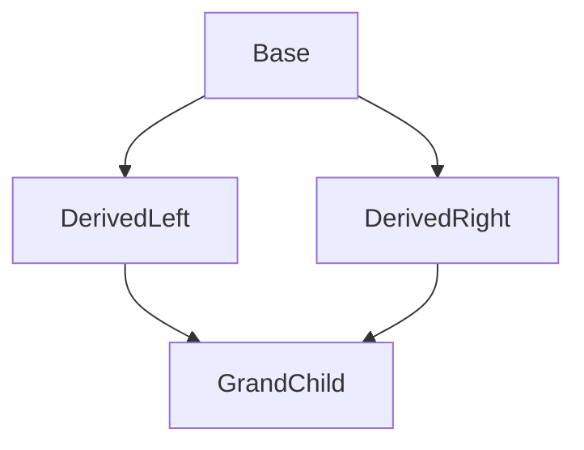

# Object-Oriented Programming (OOP) in C++: Study & Interview Guide

This guide covers core C++ OOP concepts and dives deep into advanced mechanics, memory layouts, and design patterns frequently asked in technical interviews.

---

## Part 1: Core OOP Concepts in C++

### 1. Classes and Objects

A **Class** is a user-defined data type that acts as a blueprint for creating objects. It contains data members (attributes/fields) and member functions (methods).
An **Object** is an instance of a class. When a class is defined, no memory is allocated. Memory is allocated only when an object is instantiated.

#### Instantiation: Stack vs. Heap Allocation
In C++, you can allocate objects on the stack (automatic lifetime) or the heap (dynamic lifetime).

```cpp
#include <iostream>
#include <string>

class Car {
public:
    std::string brand;
    int speed;

    void display() const {
        std::cout << brand << " is moving at " << speed << " km/h.\n";
    }
};

int main() {
    // 1. Stack Allocation (Value Semantics)
    // Memory is allocated automatically on the stack frame.
    // Cleaned up automatically when the object goes out of scope.
    Car stackCar;
    stackCar.brand = "Toyota";
    stackCar.speed = 120;
    stackCar.display(); // Access via dot (.) operator

    // 2. Heap Allocation (Pointer Semantics)
    // Memory is allocated on the free store (heap) using 'new'.
    // Lifetime is manual; requires explicit 'delete' to avoid memory leaks.
    Car* heapCar = new Car();
    heapCar->brand = "Tesla";
    heapCar->speed = 150;
    heapCar->display(); // Access via arrow (->) operator

    delete heapCar; // Manual cleanup
    heapCar = nullptr; // Avoid dangling pointer
}
```

---

### 2. Working with Multiple Classes and Files

In professional C++ development, classes are separated into distinct files to organize the codebase and speed up compilation:
1.  **Header File (`.h` or `.hpp`)**: Contains class declarations (member variables and function prototypes).
2.  **Implementation File (`.cpp`)**: Contains the definitions/bodies of the member functions.
3.  **Include Guards (`#pragma once`)**: Prevents a header file from being included multiple times in the same compilation unit, which would cause duplication errors.

#### Example:

**Car.h (Declaration)**
```cpp
#pragma once
#include <string>

class Car {
private:
    std::string brand;
    int speed;

public:
    Car(std::string b, int s); // Constructor prototype
    void describe() const;     // Method prototype
};
```

**Car.cpp (Implementation)**
```cpp
#include "Car.h"
#include <iostream>

// Use scope resolution operator (::) to define member functions
Car::Car(std::string b, int s) : brand(b), speed(s) {}

void Car::describe() const {
    std::cout << brand << " car moving at " << speed << " km/h\n";
}
```

**main.cpp (Usage)**
```cpp
#include "Car.h"

int main() {
    Car myCar("Honda", 80);
    myCar.describe();
    return 0;
}
```

---

### 3. Access Specifiers

Access specifiers define the scope and visibility of class members. C++ applies them in **labeled blocks** rather than on each individual member.

*   `public`: Members are accessible from outside the class.
*   `private` (Default): Members are accessible only within the class itself and by `friend` classes/functions.
*   `protected`: Members are accessible within the class and by its derived (child) classes.

```cpp
class Account {
private:
    double balance; // Restricted access

protected:
    std::string accountHolder; // Accessible by derived classes

public:
    Account(std::string holder, double initialBalance) 
        : accountHolder(holder), balance(initialBalance) {}

    double getBalance() const { return balance; } // Public getter
};
```

---

### 4. Constructors and Destructors

#### Types of Constructors
Constructors initialize objects. C++ supports several types:
1.  **Default Constructor**: Takes no arguments.
2.  **Parameterized Constructor**: Takes arguments to initialize members with custom values.
3.  **Copy Constructor**: Initializes a new object as a copy of an existing object: `ClassName(const ClassName& other)`.
4.  **Move Constructor** (C++11): Transfers ownership of resources from a temporary object without copying: `ClassName(ClassName&& other) noexcept`.

#### Member Initializer Lists
Using a Member Initializer List (`Constructor() : member1(val1), member2(val2) {}`) is more efficient than assignment inside the constructor body (`member1 = val1;`).
*   **Direct Initialization**: It calls the constructor of the member directly, avoiding the overhead of default construction followed by assignment.
*   **Mandatory Use Cases**: Must be used for initializing `const` members and references (`&`), as they cannot be assigned after creation.

> [!WARNING]
> Members are initialized in the **order of their declaration** in the class definition, NOT the order they appear in the initializer list. Misordering them can cause undefined behavior if one member depends on another.

#### Destructors
Destructors (`~ClassName()`) clean up resources (freeing memory, closing file streams, releasing locks) when an object's lifetime ends. They take no arguments and cannot be overloaded.

```cpp
#include <iostream>
#include <utility>

class ResourceManager {
private:
    int* data;
    int size;

public:
    // 1. Parameterized Constructor & Initializer List
    ResourceManager(int s) : size(s), data(new int[s]) {
        std::cout << "Resource allocated.\n";
    }

    // 2. Copy Constructor (Deep Copy)
    ResourceManager(const ResourceManager& other) : size(other.size), data(new int[other.size]) {
        for (int i = 0; i < size; ++i) {
            data[i] = other.data[i];
        }
        std::cout << "Resource copied.\n";
    }

    // 3. Move Constructor (Resource Transfer)
    ResourceManager(ResourceManager&& other) noexcept : data(other.data), size(other.size) {
        other.data = nullptr; // Nullify source pointer to prevent double deletion
        other.size = 0;
        std::cout << "Resource moved.\n";
    }

    // 4. Destructor
    ~ResourceManager() {
        delete[] data; // Free allocated memory
        std::cout << "Resource deallocated.\n";
    }
};
```

---

### 5. Encapsulation

Encapsulation is the bundling of data (attributes) and the methods that operate on them into a single unit (class), while hiding internal implementation details (`private` members) and exposing interface functions (`public` getters/setters).

**Const Correctness**: Getter methods should be declared `const` to guarantee they do not modify the object's state, allowing them to be called on `const` object references.

```cpp
class User {
private:
    std::string username;

public:
    // Getter: marked const because it does not alter internal variables
    std::string getUsername() const {
        return username;
    }

    // Setter: updates the state
    void setUsername(const std::string& newName) {
        if (!newName.empty()) {
            username = newName;
        }
    }
};
```

---

### 6. Inheritance

Inheritance allows a derived class to reuse and extend code from a base class.

```cpp
class Vehicle {
public:
    void honk() const { std::cout << "Beep beep!\n"; }
};

// Car inherits from Vehicle
class Car : public Vehicle {};
```

#### Inheritance Access Modes
The inheritance specifier (`class Derived : AccessMode Base`) alters the access level of the base class's members within the derived class:

| Base Member Access | Public Inheritance (`: public Base`) | Protected Inheritance (`: protected Base`) | Private Inheritance (`: private Base`) |
| :--- | :--- | :--- | :--- |
| **`public`** | stays `public` in derived | becomes `protected` in derived | becomes `private` in derived |
| **`protected`** | stays `protected` in derived | stays `protected` in derived | becomes `private` in derived |
| **`private`** | hidden/inaccessible in derived | hidden/inaccessible in derived | hidden/inaccessible in derived |

*   **Public Inheritance**: Models an **IS-A** relationship (e.g., a `Car` is a `Vehicle`).
*   **Private/Protected Inheritance**: Models a **has-a-implemented-in-terms-of** relationship, hiding base functionality from external users.

#### The `final` Keyword (C++11)
*   **Prevent Inheritance**: Mark a class `final` so it cannot be used as a base class.
*   **Prevent Overriding**: Mark a virtual function `final` to block derived classes from overriding it.

```cpp
class Uninheritable final { /* ... */ };

class Base {
public:
    virtual void show() {}
};

class Derived : public Base {
public:
    void show() override final {} // Cannot be overridden by grandchildren
};
```

---

### 7. Polymorphism

#### A. Compile-Time Polymorphism (Static Binding)
Resolved at compile time. It is highly efficient because there is no runtime overhead.

*   **Function Overloading**: Multiple functions in the same scope sharing a name but having different parameter signatures (type, order, or count). *Note: Functions cannot be overloaded based solely on return type.*
*   **Operator Overloading**: Customizing standard operator behaviors for user-defined classes.

```cpp
class Vector2D {
public:
    float x, y;

    // Operator overloading
    Vector2D operator+(const Vector2D& other) const {
        return Vector2D{x + other.x, y + other.y};
    }
};
```

#### B. Runtime Polymorphism (Dynamic Binding)
Resolved at runtime using virtual functions.

*   **`virtual` keyword**: Tells the compiler to perform dynamic dispatch on this function.
*   **`override` keyword**: Instructs the compiler to verify that a signature matches a base virtual function exactly, preventing typos or signature mismatches.

```cpp
#include <iostream>

class Shape {
public:
    virtual void draw() const {
        std::cout << "Drawing a generic shape.\n";
    }
    virtual ~Shape() = default; // Essential for base classes!
};

class Circle : public Shape {
public:
    void draw() const override {
        std::cout << "Drawing a circle.\n";
    }
};

void render(const Shape& shape) {
    shape.draw(); // Calls draw() depending on runtime object type
}
```

---

### 8. Abstraction and Interfaces

**Abstraction** is the process of hiding internal details and showing only the essential features of an object. In C++, this is achieved using abstract classes and interfaces.

#### Pure Virtual Functions and Abstract Classes
A class is automatically made abstract if it contains at least one **pure virtual function** (declared with `= 0` and no body). You cannot instantiate an abstract class.

#### Interfaces in C++
Unlike C# or Java, C++ does not have an `interface` keyword. An **Interface** is created by declaring a class containing **only public pure virtual functions** and a **virtual destructor** (to ensure proper deletion of implementing classes), with no member variables.

```cpp
#include <iostream>

// Interface definition (Pure Abstract Class)
class IAnimal {
public:
    virtual ~IAnimal() = default; // Virtual destructor is mandatory
    virtual void makeSound() const = 0; // Pure virtual function
};

class Pig : public IAnimal {
public:
    void makeSound() const override {
        std::cout << "The pig says: wee wee\n";
    }
};

// C++ allows implementing multiple interfaces via multiple inheritance
class ISwimmer {
public:
    virtual ~ISwimmer() = default;
    virtual void swim() = 0;
};

class Duck : public IAnimal, public ISwimmer {
public:
    void makeSound() const override { std::cout << "Quack!\n"; }
    void swim() override { std::cout << "Duck is swimming.\n"; }
};
```

---

### 9. Enums and Enum Classes

An enum represents a set of named integer constants. C++ has two types of enums:

#### 1. Unscoped Enums (`enum`)
Traditional C-style enums. They pollute the surrounding namespace (constants can clash with other variables) and implicitly convert to integers.

#### 2. Scoped Enums (`enum class` - C++11)
Strongly typed and scoped. They do not pollute the surrounding scope and do not implicitly convert to integers (requires `static_cast`).

```cpp
#include <iostream>

// Unscoped Enum
enum Level {
    LOW,
    MEDIUM,
    HIGH = 4 // Custom value assignment
};

// Scoped Enum (Strongly Typed)
enum class TrafficLight {
    Red,
    Yellow,
    Green
};

int main() {
    Level myLevel = MEDIUM;
    int rawValue = myLevel; // Implicit conversion allowed (Value: 1)

    TrafficLight light = TrafficLight::Red;
    // int colorVal = light; // Compile Error! No implicit conversion
    int colorVal = static_cast<int>(light); // Explicit cast allowed

    if (light == TrafficLight::Red) {
        std::cout << "Stop! Value: " << colorVal << "\n";
    }
}
```

---

### 10. File Handling in C++

File operations in C++ are handled using the `<fstream>` library:
*   `std::ofstream`: Stream class to write on files.
*   `std::ifstream`: Stream class to read from files.
*   `std::fstream`: Stream class to both read and write.

```cpp
#include <iostream>
#include <fstream>
#include <string>
#include <filesystem> // C++17 for directory/file verification

int main() {
    std::string filename = "testfile.txt";

    // 1. Writing to a file (Create / Overwrite)
    std::ofstream outFile(filename);
    if (outFile.is_open()) {
        outFile << "Line 1: Hello C++ File I/O!\n";
        outFile << "Line 2: Object-Oriented writing.\n";
        outFile.close();
    }

    // 2. Appending text to an existing file
    std::ofstream appendFile(filename, std::ios::app);
    if (appendFile.is_open()) {
        appendFile << "Line 3: Appended content.\n";
        appendFile.close();
    }

    // 3. Verifying File Existence
    if (std::filesystem::exists(filename)) {
        std::cout << "File exists! Opening for read:\n";
    }

    // 4. Reading from a file line by line
    std::ifstream inFile(filename);
    std::string line;
    if (inFile.is_open()) {
        while (std::getline(inFile, line)) {
            std::cout << line << "\n";
        }
        inFile.close();
    }
}
```

---

### 11. Exception Handling

C++ uses `try`, `catch`, and `throw` blocks for error management. The standard library provides a hierarchy of exception classes derived from `std::exception`.

#### Key Concepts:
*   **std::exception**: Base class for all standard C++ exceptions. Common subclasses are `std::runtime_error`, `std::out_of_range`, and `std::invalid_argument`.
*   **Catching by Reference**: Catching `const std::exception& e` prevents **object slicing** and ensures polymorphic exception messages (`e.what()`) are displayed correctly.
*   **Custom Exceptions**: Created by inheriting from `std::exception` and overriding `what()`.

```cpp
#include <iostream>
#include <exception>
#include <stdexcept>
#include <string>

// Custom Exception Class
class AccessDeniedException : public std::exception {
private:
    std::string message;
public:
    AccessDeniedException(std::string msg) : message(std::move(msg)) {}
    
    // Override what() to return details
    const char* what() const noexcept override {
        return message.c_str();
    }
};

void checkAge(int age) {
    if (age < 18) {
        throw AccessDeniedException("Access denied - User is under 18 years old.");
    }
}

int main() {
    try {
        int numbers[] = {1, 2, 3};
        // Trigger standard exception
        if (5 > 2) {
            throw std::out_of_range("Array index out of bounds.");
        }
    }
    catch (const std::out_of_range& e) {
        std::cout << "Caught standard exception: " << e.what() << "\n";
    }

    try {
        checkAge(15);
    }
    catch (const AccessDeniedException& e) {
        std::cout << "Caught custom exception: " << e.what() << "\n";
    }
    catch (const std::exception& e) {
        std::cout << "Generic fallback exception catch: " << e.what() << "\n";
    }
}
```

#### No `finally` Block in C++?
Unlike C# or Java, **C++ does not have a `finally` block**. Instead, resource cleanup is handled automatically using the **RAII (Resource Acquisition Is Initialization)** pattern. Destructors of stack-allocated objects are guaranteed to run when they go out of scope, even during an exception unwind.

---

## Part 2: Frequently Asked C++ OOP Interview Questions & Concepts

### 1. VTABLE and VPTR Mechanics
**Question**: *How does dynamic dispatch (runtime polymorphism) work under the hood in C++?*

When a class declares or inherits a virtual function, the compiler inserts a hidden pointer member (usually called the **`vptr`**) into the class layout. The `vptr` points to a static table of function pointers called the **`vtable`** (virtual table) unique to that class.

#### Key Mechanics:
1.  Each class with virtual functions has exactly **one** `vtable` shared among all instances.
2.  Each object has its own unique `vptr` stored in its memory payload (increasing object size by `sizeof(void*)`).
3.  When calling `ptr->virtual_function()`, the compiler generates assembly to:
    *   Dereference the pointer to find the object.
    *   Dereference the object's `vptr` to locate the `vtable`.
    *   Look up the offset corresponding to `virtual_function` in the table.
    *   Call the function at that address.

#### Memory Layout Diagram:
```
Object Instance (Heap/Stack)              VTABLE (Static Data Segment)
+-------------------------+               +----------------------------------+
| vptr (Pointer to Table) | ------------> | Offset [0]: &Base::func1         |
+-------------------------+               | Offset [1]: &Derived::func2      |
| Member Variable: age    |               +----------------------------------+
+-------------------------+
```

---

### 2. Virtual Destructors
**Question**: *Why must a base class destructor be declared virtual? What happens if it isn't?*

If a base class destructor is not virtual, deleting a derived class object through a base class pointer results in **undefined behavior**—specifically, only the base class destructor runs, causing a resource or memory leak of the derived parts.

```cpp
#include <iostream>

class Base {
public:
    Base() {}
    // If not virtual, deleting Derived* via Base* won't call ~Derived()
    virtual ~Base() { 
        std::cout << "Base Cleaned Up\n"; 
    }
};

class Derived : public Base {
private:
    int* largeArray;
public:
    Derived() : largeArray(new int[1000]) {}
    ~Derived() override {
        delete[] largeArray;
        std::cout << "Derived Cleaned Up (Large array freed)\n";
    }
};

int main() {
    Base* ptr = new Derived();
    delete ptr; // Calls ~Derived() first, then ~Base(). Clean cleanup!
}
```

---

### 3. Pure Virtual Destructors
**Question**: *Can a pure virtual function have a body? What is a pure virtual destructor, and why would you use it?*

Yes, a pure virtual function **can** have a body, though it must be defined outside the class declaration.
A **pure virtual destructor** (`virtual ~MyClass() = 0;`) is used when you want to make a class abstract (preventing instantiation) but have no other candidate member functions to make pure virtual.

> [!IMPORTANT]
> You **MUST** provide a body for a pure virtual destructor. This is because derived class destructors always implicitly call the base destructor in reverse order of construction. If no body exists, the linker throws an unresolved external reference error.

```cpp
class AbstractBase {
public:
    virtual ~AbstractBase() = 0; // Pure virtual declaration
};

// Mandatory definition
AbstractBase::~AbstractBase() {
    // Cleanup code (if any)
}

class ConcreteDerived : public AbstractBase {
public:
    ~ConcreteDerived() override {}
};
```

---

### 4. The Diamond Problem & Virtual Inheritance
**Question**: *What is the Diamond Problem, and how is it resolved in C++?*

The Diamond Problem occurs in multiple inheritance when a class inherits from two classes that both share a common ancestor. This creates two duplicate subobjects of the grandparent class, causing member lookup ambiguity and wasted memory.



#### The Fix: Virtual Inheritance
By inheriting the shared base class as `virtual`, C++ guarantees only **one** instance of the shared grandparent subobject is constructed.

```cpp
#include <iostream>

class Parent {
public:
    int data = 42;
};

// Inheriting virtually prevents duplication
class Left : virtual public Parent {};
class Right : virtual public Parent {};

class Child : public Left, public Right {};

int main() {
    Child obj;
    // Ambiguity resolved: Left and Right share one single Parent subobject.
    std::cout << obj.data << "\n"; // Output: 42
}
```

---

### 5. Object Slicing
**Question**: *What is object slicing? How does it occur, and how do you prevent it?*

Object slicing occurs when a derived class object is assigned to a base class object **by value**. The extra data and specialized behaviors of the derived class are sliced away because the base object does not have memory allocated for derived members.

```cpp
#include <iostream>

class Base {
public:
    virtual void whoAmI() const { std::cout << "I am Base\n"; }
};

class Derived : public Base {
public:
    void whoAmI() const override { std::cout << "I am Derived\n"; }
};

void runByValue(Base b) {
    b.whoAmI(); // Slicing occurs! Outputs "I am Base"
}

void runByReference(const Base& b) {
    b.whoAmI(); // Polymorphic! Outputs "I am Derived"
}

int main() {
    Derived d;
    runByValue(d);     // Sliced
    runByReference(d); // Safe
}
```

---

### 6. Rule of Three, Five, and Zero
**Question**: *Explain the Rule of Three, Five, and Zero in Modern C++.*

#### Rule of Three (Pre-C++11)
If a class requires a custom implementation of any of these three, it likely manages a raw resource and requires custom implementations of **all three**:
1.  **Destructor**: to free resource.
2.  **Copy Constructor**: to perform a deep copy.
3.  **Copy Assignment Operator**: to prevent self-assignment and clean up old resources before copying.

#### Rule of Five (C++11 onward)
With the introduction of move semantics, to prevent redundant copying of temporaries, you should implement two additional special member functions (making five total):
4.  **Move Constructor**: transfer resource.
5.  **Move Assignment Operator**: clean up current resource and take ownership of the new one.

```cpp
class MyBuffer {
private:
    int* buffer;
    int size;

public:
    MyBuffer(int s) : size(s), buffer(new int[s]) {}

    // 1. Destructor
    ~MyBuffer() { delete[] buffer; }

    // 2. Copy Constructor
    MyBuffer(const MyBuffer& other) : size(other.size), buffer(new int[other.size]) {
        std::copy(other.buffer, other.buffer + size, buffer);
    }

    // 3. Copy Assignment Operator
    MyBuffer& operator=(const MyBuffer& other) {
        if (this == &other) return *this; // Self-assignment check
        
        int* temp = new int[other.size];
        std::copy(other.buffer, other.buffer + other.size, temp);
        
        delete[] buffer; // Clear current resource
        buffer = temp;
        size = other.size;
        return *this;
    }

    // 4. Move Constructor
    MyBuffer(MyBuffer&& other) noexcept : buffer(other.buffer), size(other.size) {
        other.buffer = nullptr;
        other.size = 0;
    }

    // 5. Move Assignment Operator
    MyBuffer& operator=(MyBuffer&& other) noexcept {
        if (this == &other) return *this;

        delete[] buffer; // Cleanup current resource
        
        buffer = other.buffer; // Take ownership
        size = other.size;
        
        other.buffer = nullptr; // Nullify source
        other.size = 0;
        return *this;
    }
};
```

#### Rule of Zero
Modern C++ design suggests that you should design your classes so that they **do not need** to define any of the special member functions. Instead, rely on standard library types like `std::string`, `std::vector`, or smart pointers (`std::unique_ptr`), which handle resource management automatically.

---

### 7. Deep Copy vs. Shallow Copy
**Question**: *What is the difference between deep copying and shallow copying?*

*   **Shallow Copy**: Copies only member values. If a member is a pointer, both the original and copied objects will point to the same memory address. This leads to double-free undefined behaviors when both objects attempt to run their destructors. The default compiler-generated copy constructor performs a shallow copy.
*   **Deep Copy**: Copies all members, allocates separate new memory for any pointed-to resources, and copies the contents into that new memory. Changes to the duplicate do not affect the original.

---

### 8. Friend Functions and Friend Classes
**Question**: *What is the `friend` keyword used for? Does it break encapsulation?*

A function or class marked as `friend` inside a target class is granted access to that target class's `private` and `protected` members.

```cpp
class Box {
private:
    double width;

public:
    Box(double w) : width(w) {}

    // Friend function declaration
    friend void printWidth(const Box& b);
};

void printWidth(const Box& b) {
    // Can access private member width directly
    std::cout << "Width: " << b.width << "\n";
}
```

*   **Encapsulation debate**: It does not strictly break encapsulation. Rather, it extends the interface of the class. It is often used to overload binary operators (like input/output stream operators `<<` and `>>`) or tightly coupled helper classes.
*   **Inheritance rule**: Friendship is **not inherited, not transitive, and not symmetric**. If A is a friend of B, and B is a friend of C, A is not automatically a friend of C.

---

### 9. `this` Pointer & Const Member Functions
**Question**: *What is the `this` pointer? What is its type in a const member function vs. non-const member function?*

The `this` pointer is an implicit parameter passed to all non-static member functions. It points to the object instance invoking the method.

*   In a **non-const** member function of class `X`, the type of `this` is `X* const` (a constant pointer to a mutable object).
*   In a **const** member function of class `X`, the type of `this` is `const X* const` (a constant pointer to a constant object). This prevents changing any non-`mutable` data members.

---

### 10. Static Members
**Question**: *How do static attributes and static member functions behave in C++?*

*   **Static Variables**: Shared across all instances of the class. They have static storage lifetime (exist for the duration of the program).
    *   *Gotcha*: Static variables must be **declared** inside the class but **defined and initialized** outside the class in a source file, unless declared `inline` (C++17) or `constexpr`.
*   **Static Functions**: Belong to the class itself, not any object. They can only access static members and cannot access the `this` pointer.

```cpp
class Counter {
public:
    static int count; // Declaration
    static void increment() { count++; } // Static function
};

// Definition outside class (crucial for linker)
int Counter::count = 0;
```

---

### 11. `explicit` Keyword
**Question**: *What does the `explicit` keyword do, and why should constructors be marked explicit by default?*

By default, any constructor that can be called with a single argument acts as an **implicit conversion constructor**. The compiler uses it to convert values of the argument's type to the class type behind the scenes, which can lead to hard-to-find logical bugs.

Adding `explicit` blocks these implicit conversions.

```cpp
#include <iostream>

class MyVector {
public:
    explicit MyVector(int size) {
        std::cout << "Vector initialized with size: " << size << "\n";
    }
};

void processVector(const MyVector& v) {}

int main() {
    // Safe explicitly:
    MyVector v1(10); 

    // Error: compiler is prevented from converting 10 to a MyVector implicitly
    // processVector(10); 
    
    // Fix: force explicit construction
    processVector(MyVector(10));
}
```

---

### 12. RAII (Resource Acquisition Is Initialization)
**Question**: *Explain RAII and why it is fundamental to exception safety in C++.*

RAII is a programming idiom where resource acquisition (memory, files, network sockets, mutexes) is tied to the **lifetime of a local object**.
*   **Acquisition**: The resource is acquired in the object's constructor.
*   **Release**: The resource is automatically released in the object's destructor.

Because C++ guarantees that all stack-allocated objects are destructed when leaving a scope (even if an exception is thrown), RAII prevents leaks without needing tedious `try-catch` blocks or manual cleanups.

```cpp
#include <fstream>
#include <string>

class FileWrapper {
private:
    std::ofstream fileStream;

public:
    FileWrapper(const std::string& filename) {
        fileStream.open(filename); // Resource acquired
    }

    void write(const std::string& text) {
        fileStream << text;
    }

    ~FileWrapper() {
        if (fileStream.is_open()) {
            fileStream.close(); // Resource automatically released
        }
    }
}; // FileWrapper guarantees the file closes even if exceptions occur during use!
```

---

### 13. Smart Pointers and Object Lifetimes
**Question**: *How do smart pointers manage resource ownership and lifetimes?*

Smart pointers are RAII templates that wrap raw pointers to automatically manage their memory cleanup.

1.  **`std::unique_ptr`**: Models **exclusive ownership**. It cannot be copied, only moved. The managed resource is deleted automatically when the `unique_ptr` goes out of scope.
2.  **`std::shared_ptr`**: Models **shared ownership**. It uses a reference-counted control block. The resource is deleted when the last `shared_ptr` pointing to it is destroyed or reset.
3.  **`std::weak_ptr`**: Holds a non-owning, temporary reference to a resource managed by `std::shared_ptr`. It does not increase the reference count. It is used to resolve circular references (which cause memory leaks).

```cpp
#include <memory>
#include <iostream>

class Node {
public:
    std::shared_ptr<Node> next;
    std::weak_ptr<Node> prev; // weak_ptr prevents reference cycles
    ~Node() { std::cout << "Node destroyed\n"; }
};

int main() {
    // unique_ptr example
    std::unique_ptr<int> uptr = std::make_unique<int>(100);
    // std::unique_ptr<int> copy = uptr; // Error! Cannot copy unique_ptr
    std::unique_ptr<int> moved = std::move(uptr); // Allowed
    
    // shared_ptr/weak_ptr cycle prevention
    auto first = std::make_shared<Node>();
    auto second = std::make_shared<Node>();

    first->next = second;
    second->prev = first; // weak reference points back
} // Both nodes are cleanly destroyed here because of weak_ptr
```
