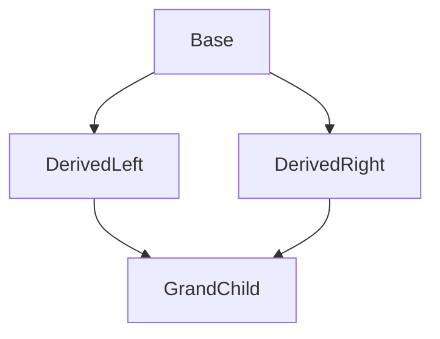

# Object-Oriented Programming (OOP) in C++: Comprehensive Study & Interview Guide

This guide covers every core C++ OOP concept, advanced internals, design principles, patterns, and real-world scenarios that are frequently asked in technical interviews.

---

# Part 1: OOP Foundations

## 1.1 What is OOP?

**Object-Oriented Programming (OOP)** is a programming paradigm that organizes software design around **objects** — bundles of data (attributes) and behavior (methods) — rather than around functions and logic alone.

### The Four Pillars of OOP
1.  **Encapsulation**: Bundling data and methods together inside a class, restricting direct access to internals.
2.  **Abstraction**: Hiding complex implementation details and exposing only the essential interface.
3.  **Inheritance**: Creating new classes from existing ones, reusing and extending behavior.
4.  **Polymorphism**: Allowing a single interface to represent different underlying types/behaviors.

### OOP vs. Procedural Programming

| Aspect | Procedural | Object-Oriented |
| :--- | :--- | :--- |
| **Organization** | Functions operating on separate data | Objects encapsulate data + behavior |
| **Data Access** | Data is often global or passed around | Data is hidden inside objects |
| **Reusability** | Copy-paste or function libraries | Inheritance, composition, polymorphism |
| **Extensibility** | Modify existing functions | Add new classes without changing existing code (Open/Closed) |
| **Modularity** | File-level separation | Class-level separation; each team member works on different classes |

### Benefits of OOP
*   **Modularity**: Classes are self-contained modules. Teams can work independently on different classes.
*   **Reusability**: Inheritance and composition let you reuse existing code without rewriting it.
*   **Maintainability**: Encapsulation localizes changes — modifying a class's internals doesn't break callers.
*   **Extensibility**: Polymorphism allows adding new types without modifying existing code.
*   **Real-World Mapping**: Objects model real entities (e.g., `User`, `Order`, `Account`), making systems intuitive.

### Message Passing
In OOP, objects communicate by sending **messages** to each other — i.e., calling methods on other objects. The caller doesn't need to know the internal implementation; it only knows the interface.

```cpp
class Printer {
public:
    void print(const std::string& text) {
        std::cout << text << "\n";
    }
};

class Document {
public:
    void sendToPrinter(Printer& p) {
        p.print("Hello from Document!"); // Message passing
    }
};
```

---

# Part 2: Core OOP Concepts in C++

## 2.1 Classes and Objects

A **Class** is a user-defined data type that acts as a blueprint for creating objects. It contains data members (attributes/fields) and member functions (methods).
An **Object** is an instance of a class. When a class is defined, no memory is allocated. Memory is allocated only when an object is instantiated.

*   A **field** (or attribute) is a variable declared directly in a class.
*   A **method** is a function that belongs to a class and typically operates on that object's data.
*   **Instance variables** belong to each individual object (each object gets its own copy). **Local variables** exist only within a method's scope.

### Instantiation: Stack vs. Heap Allocation
In C++, you can allocate objects on the stack (automatic lifetime) or the heap (dynamic lifetime).

```cpp
#include <iostream>
#include <string>

class Car {
public:
    std::string brand;
    int speed;

    void display() const {
        std::cout << brand << " is moving at " << speed << " km/h.\n";
    }
};

int main() {
    // 1. Stack Allocation (Value Semantics)
    // Memory is allocated automatically on the stack frame.
    // Cleaned up automatically when the object goes out of scope.
    Car stackCar;
    stackCar.brand = "Toyota";
    stackCar.speed = 120;
    stackCar.display(); // Access via dot (.) operator

    // 2. Heap Allocation (Pointer Semantics)
    // Memory is allocated on the free store (heap) using 'new'.
    // Lifetime is manual; requires explicit 'delete' to avoid memory leaks.
    Car* heapCar = new Car();
    heapCar->brand = "Tesla";
    heapCar->speed = 150;
    heapCar->display(); // Access via arrow (->) operator

    delete heapCar; // Manual cleanup
    heapCar = nullptr; // Avoid dangling pointer
}
```

### Object Reference vs. Actual Object
*   On the **stack**, the variable name (`stackCar`) IS the object itself — value semantics.
*   On the **heap**, the variable (`heapCar`) is a **pointer** — it stores the memory address of the actual object. The object lives elsewhere in memory.

### Anonymous (Temporary) Objects
A temporary object is created without naming it. It exists only for the duration of the expression.

```cpp
// Temporary object: created, used, and destroyed in one expression
void process(const Car& c) { c.display(); }
process(Car{"BMW", 200}); // Anonymous Car object
```

---

## 2.2 `struct` vs. `class` in C++

In C++, `struct` and `class` are almost identical. The **only** difference is the **default access level**:
*   `struct`: Members are `public` by default.
*   `class`: Members are `private` by default.

Convention: Use `struct` for simple data holders (POD types) and `class` for objects with invariants and behavior.

```cpp
struct Point { int x, y; };        // x,y are public
class  Circle { int radius; };     // radius is private
```

---

## 2.3 Working with Multiple Classes and Files

In professional C++ development, classes are separated into distinct files to organize the codebase and speed up compilation:
1.  **Header File (`.h` or `.hpp`)**: Contains class declarations (member variables and function prototypes).
2.  **Implementation File (`.cpp`)**: Contains the definitions/bodies of the member functions.
3.  **Include Guards (`#pragma once`)**: Prevents a header file from being included multiple times in the same compilation unit, which would cause duplication errors.

#### Example:

**Car.h (Declaration)**
```cpp
#pragma once
#include <string>

class Car {
private:
    std::string brand;
    int speed;

public:
    Car(std::string b, int s); // Constructor prototype
    void describe() const;     // Method prototype
};
```

**Car.cpp (Implementation)**
```cpp
#include "Car.h"
#include <iostream>

// Use scope resolution operator (::) to define member functions
Car::Car(std::string b, int s) : brand(b), speed(s) {}

void Car::describe() const {
    std::cout << brand << " car moving at " << speed << " km/h\n";
}
```

**main.cpp (Usage)**
```cpp
#include "Car.h"

int main() {
    Car myCar("Honda", 80);
    myCar.describe();
    return 0;
}
```

---

## 2.4 Access Specifiers

Access specifiers define the scope and visibility of class members. C++ applies them in **labeled blocks** rather than on each individual member.

*   `public`: Members are accessible from outside the class.
*   `private` (Default for `class`): Members are accessible only within the class itself and by `friend` classes/functions.
*   `protected`: Members are accessible within the class and by its derived (child) classes.

```cpp
class Account {
private:
    double balance; // Restricted access

protected:
    std::string accountHolder; // Accessible by derived classes

public:
    Account(std::string holder, double initialBalance) 
        : accountHolder(holder), balance(initialBalance) {}

    double getBalance() const { return balance; } // Public getter
};
```

### How Access Modifiers Support Encapsulation in Large Codebases
*   `private` ensures internal representation can change without breaking callers.
*   `protected` grants controlled access to subclasses without exposing internals publicly.
*   **Misuse example**: Making all members `public` "for convenience" destroys encapsulation — any part of the codebase can create invalid states. A `BankAccount` with a public `balance` field lets anyone set it to -999.

---

## 2.5 Constructors and Destructors

### Types of Constructors
Constructors initialize objects. C++ supports several types:
1.  **Default Constructor**: Takes no arguments. Compiler generates one automatically if no constructors are written.
2.  **Parameterized Constructor**: Takes arguments to initialize members with custom values.
3.  **Copy Constructor**: Initializes a new object as a copy of an existing object: `ClassName(const ClassName& other)`.
4.  **Move Constructor** (C++11): Transfers ownership of resources from a temporary object without copying: `ClassName(ClassName&& other) noexcept`.

### Constructor Overloading
A class can have multiple constructors with different parameter lists (same concept as function overloading).

### Member Initializer Lists
Using a Member Initializer List (`Constructor() : member1(val1), member2(val2) {}`) is more efficient than assignment inside the constructor body (`member1 = val1;`).
*   **Direct Initialization**: It calls the constructor of the member directly, avoiding the overhead of default construction followed by assignment.
*   **Mandatory Use Cases**: Must be used for initializing `const` members and references (`&`), as they cannot be assigned after creation.

> [!WARNING]
> Members are initialized in the **order of their declaration** in the class definition, NOT the order they appear in the initializer list. Misordering them can cause undefined behavior if one member depends on another.

### Delegating Constructors (Constructor Chaining — C++11)
One constructor can call another constructor of the same class to avoid code duplication:

```cpp
class Student {
    std::string name;
    int id;
    double gpa;
public:
    Student(std::string n, int i, double g) : name(n), id(i), gpa(g) {}
    Student(std::string n, int i) : Student(n, i, 0.0) {} // Delegates to 3-arg ctor
    Student() : Student("Unknown", 0) {}                   // Chains further
};
```

### Calling the Parent Constructor
In an inheritance chain, the derived class constructor must invoke the base class constructor (if not default) via the initializer list:

```cpp
class Base {
public:
    Base(int x) { /* ... */ }
};

class Derived : public Base {
public:
    Derived(int x, int y) : Base(x) { /* use y */ } // Calls Base(int)
};
```

### Order of Construction and Destruction
In an inheritance hierarchy:
1.  **Construction order**: Base class → Member fields (in declaration order) → Derived class body.
2.  **Destruction order**: Exact reverse — Derived destructor → Member destructors → Base destructor.

### Why Avoid Heavy Logic in Constructors
Constructors should focus on initialization. Performing I/O, network calls, or heavy computation:
*   Makes the object unusable if the operation fails (no return value to signal errors except exceptions).
*   Makes unit testing difficult (side effects during construction).
*   **Alternative**: Use factory methods or `init()` functions for complex setup.

### Private and Protected Constructors
*   **Private Constructor**: Prevents external instantiation. Used in **Singleton** and **Factory** patterns.
*   **Protected Constructor**: Allows only derived classes to construct base class instances — useful for abstract base classes.

```cpp
class Singleton {
private:
    Singleton() {} // Private: nobody can create directly
    static Singleton* instance;
public:
    static Singleton& getInstance() {
        static Singleton inst; // Thread-safe in C++11+
        return inst;
    }
};
```

### Destructors
Destructors (`~ClassName()`) clean up resources (freeing memory, closing file streams, releasing locks) when an object's lifetime ends. They take no arguments and cannot be overloaded.

### Why Constructors Cannot Be Virtual
A constructor creates the object; the vtable is set up *during* construction. Since the vptr hasn't been initialized until the constructor completes, there's no vtable to dispatch through — so virtual constructors are impossible.

**Workaround — Virtual Constructor Idiom (Clone Pattern)**:
```cpp
class Shape {
public:
    virtual Shape* clone() const = 0; // "Virtual constructor"
    virtual ~Shape() = default;
};

class Circle : public Shape {
public:
    Circle* clone() const override { return new Circle(*this); }
};
```

### Full Constructor/Destructor Example

```cpp
#include <iostream>
#include <utility>

class ResourceManager {
private:
    int* data;
    int size;

public:
    // 1. Parameterized Constructor & Initializer List
    ResourceManager(int s) : size(s), data(new int[s]) {
        std::cout << "Resource allocated.\n";
    }

    // 2. Copy Constructor (Deep Copy)
    ResourceManager(const ResourceManager& other) : size(other.size), data(new int[other.size]) {
        for (int i = 0; i < size; ++i) {
            data[i] = other.data[i];
        }
        std::cout << "Resource copied.\n";
    }

    // 3. Move Constructor (Resource Transfer)
    ResourceManager(ResourceManager&& other) noexcept : data(other.data), size(other.size) {
        other.data = nullptr; // Nullify source pointer to prevent double deletion
        other.size = 0;
        std::cout << "Resource moved.\n";
    }

    // 4. Destructor
    ~ResourceManager() {
        delete[] data; // Free allocated memory
        std::cout << "Resource deallocated.\n";
    }
};
```

---

## 2.6 Encapsulation

Encapsulation is the bundling of data (attributes) and the methods that operate on them into a single unit (class), while hiding internal implementation details (`private` members) and exposing interface functions (`public` getters/setters).

### Data Hiding
Data hiding is the specific practice of making fields `private` so they cannot be accessed or corrupted by external code. It is the **mechanism** that enforces encapsulation.

### Encapsulation vs. Abstraction (Practical Difference)
*   **Encapsulation** = *how* you hide and protect data (private fields + public methods).
*   **Abstraction** = *what* you choose to expose (the simplified interface).
*   **Bad design from confusing them**: Exposing all internal state via public getters/setters (encapsulation without abstraction) — the class becomes a glorified `struct` with no protection of invariants.

### Const Correctness
Getter methods should be declared `const` to guarantee they do not modify the object's state, allowing them to be called on `const` object references.

### Refactoring: Too Many Public Setters
A class that exposes public setters for every field leaks its internal state and lets callers create invalid states.
**Fix**: Replace individual setters with meaningful **behavioral methods** that enforce invariants.

```cpp
// BAD: Leaking internal state
class Order {
public:
    void setTotal(double t) { total = t; }
    void setTax(double t) { tax = t; }
private:
    double total, tax;
};

// GOOD: Encapsulated behavior
class Order {
public:
    void addItem(const Item& item) {
        total += item.price;
        tax = total * 0.1; // Tax is computed, not set manually
    }
    double getTotal() const { return total + tax; }
private:
    double total = 0, tax = 0;
};
```

### Preventing Invalid States
Encapsulation allows constructors and setters to **validate input** before modifying internal state:

```cpp
class User {
private:
    std::string username;

public:
    std::string getUsername() const { return username; }

    void setUsername(const std::string& newName) {
        if (!newName.empty()) { // Validation prevents invalid state
            username = newName;
        }
    }
};
```

---

## 2.7 Inheritance

Inheritance allows a derived class to reuse and extend code from a base class.

### IS-A vs. HAS-A Relationships
*   **IS-A (Inheritance)**: `class Car : public Vehicle` — a Car IS a Vehicle.
*   **HAS-A (Composition)**: `class Car { Engine engine; }` — a Car HAS an Engine.

### Types of Inheritance
C++ supports all major types:

```
1. Single:      Base → Derived
2. Multilevel:  Base → Middle → Derived
3. Hierarchical: Base → DerivedA, Base → DerivedB
4. Multiple:    BaseA, BaseB → Derived  (C++ supports this!)
5. Hybrid:      Combination of the above
```

```cpp
// Single
class Animal {};
class Dog : public Animal {};

// Multilevel
class Puppy : public Dog {};

// Hierarchical
class Cat : public Animal {};

// Multiple (C++ supports directly, Java/C# do not for classes)
class Flyable { public: virtual void fly() = 0; };
class Swimmable { public: virtual void swim() = 0; };
class Duck : public Flyable, public Swimmable {
public:
    void fly() override {}
    void swim() override {}
};
```

### Inheritance Access Modes
The inheritance specifier (`class Derived : AccessMode Base`) alters the access level of the base class's members within the derived class:

| Base Member Access | Public Inheritance (`: public Base`) | Protected Inheritance (`: protected Base`) | Private Inheritance (`: private Base`) |
| :--- | :--- | :--- | :--- |
| **`public`** | stays `public` in derived | becomes `protected` in derived | becomes `private` in derived |
| **`protected`** | stays `protected` in derived | stays `protected` in derived | becomes `private` in derived |
| **`private`** | hidden/inaccessible in derived | hidden/inaccessible in derived | hidden/inaccessible in derived |

*   **Public Inheritance**: Models an **IS-A** relationship (e.g., a `Car` is a `Vehicle`).
*   **Private/Protected Inheritance**: Models a **has-a-implemented-in-terms-of** relationship, hiding base functionality from external users.

### The `final` Keyword (C++11)
*   **Prevent Inheritance**: Mark a class `final` so it cannot be used as a base class.
*   **Prevent Overriding**: Mark a virtual function `final` to block derived classes from overriding it.

```cpp
class Uninheritable final { /* ... */ };

class Base {
public:
    virtual void show() {}
};

class Derived : public Base {
public:
    void show() override final {} // Cannot be overridden by grandchildren
};
```

### When is Inheritance the Right Choice?
Inheritance should be used only when:
1.  There is a genuine **IS-A** relationship.
2.  The derived class can be **substituted** for the base class everywhere (Liskov Substitution Principle).
3.  The base class was **designed for extension** (virtual methods, clear contracts).

### Design Smells Indicating Inheritance Misuse
*   **Fragile Base Class Problem**: Changes to the base class break derived classes unexpectedly.
*   **Deep hierarchies** (4+ levels): Hard to understand, hard to maintain.
*   **Overriding methods to do nothing** or throw exceptions: Violates LSP.
*   **Inheriting just for code reuse** without an IS-A relationship: Use composition instead.

### Refactoring Deep Hierarchies
*   Flatten the hierarchy by removing unnecessary intermediate classes.
*   Extract shared behavior into **composed helper objects** or **mixins**.
*   Use interfaces (pure abstract classes) to define contracts separately from implementation.

---

## 2.8 Composition over Inheritance

**Composition** means giving a class a member variable of another type instead of inheriting from it. It models a **HAS-A** relationship.

### Why Composition is Preferred
*   **Flexibility**: You can change the composed object at runtime (strategy pattern).
*   **No Fragile Base Class**: Changes to the composed class don't break the containing class's interface.
*   **Better Encapsulation**: The composed object's internals are hidden from the container's users.
*   **Avoids Deep Hierarchies**: Keeps the class tree shallow and understandable.

### When Inheritance Causes Problems → Composition Fixes Them

```cpp
// PROBLEM: Inheritance creates tight coupling
class Logger {
public:
    void log(const std::string& msg) { std::cout << msg << "\n"; }
};

class NetworkService : public Logger { // NetworkService IS-A Logger? No!
    void fetch() { log("Fetching data..."); }
};

// FIX: Composition — NetworkService HAS-A Logger
class NetworkService {
    Logger logger; // Composed, not inherited
public:
    void fetch() { logger.log("Fetching data..."); }
};
```

### Sharing Functionality Across Unrelated Classes
When multiple classes (that already have different base classes) need common behavior, you cannot use inheritance. Use composition:

```cpp
class Auditable { // Reusable component
public:
    void logAction(const std::string& action) { /* write to audit log */ }
};

class OrderService {
    Auditable audit; // Composed
public:
    void placeOrder() { audit.logAction("Order placed"); }
};

class UserService {
    Auditable audit; // Same component, different class
public:
    void createUser() { audit.logAction("User created"); }
};
```

---

## 2.9 Polymorphism

### A. Compile-Time Polymorphism (Static Binding)
Resolved at compile time. It is highly efficient because there is no runtime overhead.

*   **Function Overloading**: Multiple functions in the same scope sharing a name but having different parameter signatures (type, order, or count). *Note: Functions cannot be overloaded based solely on return type.*
*   **Operator Overloading**: Customizing standard operator behaviors for user-defined classes.

```cpp
class Vector2D {
public:
    float x, y;

    // Operator overloading
    Vector2D operator+(const Vector2D& other) const {
        return Vector2D{x + other.x, y + other.y};
    }
};
```

#### When Overloading Harms Readability
Having too many overloads with subtle differences confuses callers:
```cpp
// BAD: What does each version do? Unclear from the name alone
void process(int id);
void process(std::string name);
void process(int id, bool flag);

// BETTER: Descriptive names
void processById(int id);
void processByName(const std::string& name);
```

#### Constructor Overloading
Same concept as function overloading — multiple constructors with different parameter lists. The compiler selects the matching one based on arguments provided.

### B. Runtime Polymorphism (Dynamic Binding)
Resolved at runtime using virtual functions.

*   **`virtual` keyword**: Tells the compiler to perform dynamic dispatch on this function.
*   **`override` keyword**: Instructs the compiler to verify that a signature matches a base virtual function exactly, preventing typos or signature mismatches.

#### Rules for Method Overriding in C++
1.  The base class method must be declared `virtual`.
2.  The derived class method must have the **same name, parameters, and const-qualification**.
3.  Return type must be the same or a **covariant return type** (see below).
4.  The `override` keyword (C++11) is optional but strongly recommended for compiler checks.
5.  Access level can differ (e.g., base `public`, derived `protected`) but this is generally poor practice.

#### Can You Override a Static Method?
**No.** Static methods belong to the class, not to any instance. They are resolved at compile time and have no entry in the vtable. If a derived class defines a static method with the same name, it **hides** (shadows) the base version — it does not override it.

#### Covariant Return Types
A derived class override can return a pointer/reference to a **more derived type** than the base class function returns:

```cpp
class Base {
public:
    virtual Base* clone() const { return new Base(*this); }
};

class Derived : public Base {
public:
    Derived* clone() const override { return new Derived(*this); } // Covariant!
};
```

#### Polymorphism with Interfaces, Abstract Classes, and Concrete Classes

```cpp
#include <iostream>
#include <vector>
#include <memory>

class Shape {
public:
    virtual void draw() const = 0; // Interface / Abstract
    virtual ~Shape() = default;
};

class Circle : public Shape {
public:
    void draw() const override { std::cout << "Drawing circle\n"; }
};

class Rectangle : public Shape {
public:
    void draw() const override { std::cout << "Drawing rectangle\n"; }
};

// Polymorphism: process a list of different shapes uniformly
void renderAll(const std::vector<std::unique_ptr<Shape>>& shapes) {
    for (const auto& s : shapes) {
        s->draw(); // Correct overridden version called at runtime
    }
}
```

#### Refactoring switch/if-else Chains to Polymorphism
Replace type-code conditionals with virtual method dispatch:

```cpp
// BAD: switch on type
void draw(int shapeType) {
    switch (shapeType) {
        case 0: drawCircle(); break;
        case 1: drawRect(); break;
        // Every new shape requires modifying this function!
    }
}

// GOOD: Polymorphism — just add a new class
class Shape { public: virtual void draw() const = 0; };
class Circle : public Shape { void draw() const override { /*...*/ } };
class Rect : public Shape { void draw() const override { /*...*/ } };
// Adding Triangle requires ZERO changes to existing code.
```

### C. Templates and Compile-Time Polymorphism
C++ templates provide **parametric polymorphism** at compile time. The compiler generates a separate version of the function/class for each type used — no vtable overhead.

```cpp
template <typename T>
T maximum(T a, T b) {
    return (a > b) ? a : b;
}
// maximum(3, 5) generates int version
// maximum(3.5, 2.1) generates double version
```

### Single Dispatch vs. Multiple Dispatch
*   **Single Dispatch** (what C++ uses): The method called depends on the runtime type of **one** object (the one before the dot/arrow).
*   **Multiple Dispatch**: Method selection depends on the runtime type of **multiple** arguments. C++ does not support this natively — it can be emulated with the **Visitor Pattern** or `dynamic_cast` chains.

---

## 2.10 Abstraction and Interfaces

**Abstraction** is the process of hiding internal details and showing only the essential features of an object. In C++, this is achieved using abstract classes and interfaces.

### How Abstraction Differs from Encapsulation
*   **Abstraction** focuses on *what* an object does (the contract/interface).
*   **Encapsulation** focuses on *how* it does it (the implementation hidden behind private members).
*   Abstraction is about design; encapsulation is about implementation.

### Pure Virtual Functions and Abstract Classes
A class is automatically made abstract if it contains at least one **pure virtual function** (declared with `= 0`). You cannot instantiate an abstract class.

### Can an Abstract Class Have a Constructor?
**Yes!** Even though it cannot be instantiated directly, its constructor is called by derived class constructors to initialize the base portion. This is useful for initializing shared state.

```cpp
class Shape {
protected:
    std::string color;
public:
    Shape(const std::string& c) : color(c) {} // Constructor in abstract class
    virtual double area() const = 0;           // Pure virtual
};

class Circle : public Shape {
    double radius;
public:
    Circle(const std::string& c, double r) : Shape(c), radius(r) {} // Calls Shape ctor
    double area() const override { return 3.14159 * radius * radius; }
};
```

### Interfaces in C++
Unlike C# or Java, C++ does not have an `interface` keyword. An **Interface** is created by declaring a class containing **only public pure virtual functions** and a **virtual destructor** (to ensure proper deletion of implementing classes), with no member variables.

#### Can Interfaces Have State?
*   In C++, "interfaces" (pure abstract classes) **can** technically have static members and constants, but adding data members defeats the purpose of a pure interface.
*   Convention: Keep interfaces pure — no data members. Put shared state in abstract base classes instead.

### Interface Segregation ("Fat" Interfaces)
Don't force classes to implement methods they don't need. Split large interfaces into smaller, focused ones.

```cpp
// BAD: Fat interface — forces all implementors to implement everything
class IWorker {
public:
    virtual void work() = 0;
    virtual void eat() = 0;   // A robot doesn't eat!
    virtual void sleep() = 0; // A robot doesn't sleep!
};

// GOOD: Segregated interfaces
class IWorkable { public: virtual void work() = 0; virtual ~IWorkable() = default; };
class IFeedable { public: virtual void eat() = 0; virtual ~IFeedable() = default; };

class Robot : public IWorkable {
    void work() override { /* ... */ }
};

class Human : public IWorkable, public IFeedable {
    void work() override { /* ... */ }
    void eat() override { /* ... */ }
};
```

### Programming to an Interface
**Depend on abstractions, not concretions.** Declare variables and parameters as base class pointers/references, not concrete types:

```cpp
void process(IWorkable& worker) { // Depends on abstraction
    worker.work();
}
// Can pass Robot, Human, or any future IWorkable — no code changes needed.
```

### Abstract Class vs. Interface: When to Choose Which

| Feature | Abstract Class | Interface (Pure Abstract) |
| :--- | :--- | :--- |
| **Can have data members** | Yes | No (by convention) |
| **Can have method bodies** | Yes (non-pure methods) | No |
| **Multiple inheritance** | Causes diamond problems | Safe (no state) |
| **Use when** | Sharing common implementation | Defining a contract/capability |

```cpp
#include <iostream>

// Interface definition (Pure Abstract Class)
class IAnimal {
public:
    virtual ~IAnimal() = default;
    virtual void makeSound() const = 0;
};

class Pig : public IAnimal {
public:
    void makeSound() const override {
        std::cout << "The pig says: wee wee\n";
    }
};

// C++ allows implementing multiple interfaces via multiple inheritance
class ISwimmer {
public:
    virtual ~ISwimmer() = default;
    virtual void swim() = 0;
};

class Duck : public IAnimal, public ISwimmer {
public:
    void makeSound() const override { std::cout << "Quack!\n"; }
    void swim() override { std::cout << "Duck is swimming.\n"; }
};
```

---

## 2.11 Enums and Enum Classes

An enum represents a set of named integer constants. C++ has two types of enums:

### 1. Unscoped Enums (`enum`)
Traditional C-style enums. They pollute the surrounding namespace (constants can clash with other variables) and implicitly convert to integers.

### 2. Scoped Enums (`enum class` - C++11)
Strongly typed and scoped. They do not pollute the surrounding scope and do not implicitly convert to integers (requires `static_cast`).

```cpp
#include <iostream>

// Unscoped Enum
enum Level {
    LOW,
    MEDIUM,
    HIGH = 4 // Custom value assignment
};

// Scoped Enum (Strongly Typed)
enum class TrafficLight {
    Red,
    Yellow,
    Green
};

int main() {
    Level myLevel = MEDIUM;
    int rawValue = myLevel; // Implicit conversion allowed (Value: 1)

    TrafficLight light = TrafficLight::Red;
    // int colorVal = light; // Compile Error! No implicit conversion
    int colorVal = static_cast<int>(light); // Explicit cast allowed

    if (light == TrafficLight::Red) {
        std::cout << "Stop! Value: " << colorVal << "\n";
    }
}
```

---

## 2.12 File Handling in C++

File operations in C++ are handled using the `<fstream>` library:
*   `std::ofstream`: Stream class to write on files.
*   `std::ifstream`: Stream class to read from files.
*   `std::fstream`: Stream class to both read and write.

```cpp
#include <iostream>
#include <fstream>
#include <string>
#include <filesystem> // C++17 for directory/file verification

int main() {
    std::string filename = "testfile.txt";

    // 1. Writing to a file (Create / Overwrite)
    std::ofstream outFile(filename);
    if (outFile.is_open()) {
        outFile << "Line 1: Hello C++ File I/O!\n";
        outFile << "Line 2: Object-Oriented writing.\n";
        outFile.close();
    }

    // 2. Appending text to an existing file
    std::ofstream appendFile(filename, std::ios::app);
    if (appendFile.is_open()) {
        appendFile << "Line 3: Appended content.\n";
        appendFile.close();
    }

    // 3. Verifying File Existence
    if (std::filesystem::exists(filename)) {
        std::cout << "File exists! Opening for read:\n";
    }

    // 4. Reading from a file line by line
    std::ifstream inFile(filename);
    std::string line;
    if (inFile.is_open()) {
        while (std::getline(inFile, line)) {
            std::cout << line << "\n";
        }
        inFile.close();
    }
}
```

---

## 2.13 Exception Handling

C++ uses `try`, `catch`, and `throw` blocks for error management. The standard library provides a hierarchy of exception classes derived from `std::exception`.

### Key Concepts:
*   **std::exception**: Base class for all standard C++ exceptions. Common subclasses are `std::runtime_error`, `std::out_of_range`, and `std::invalid_argument`.
*   **Catching by Reference**: Catching `const std::exception& e` prevents **object slicing** and ensures polymorphic exception messages (`e.what()`) are displayed correctly.
*   **Custom Exceptions**: Created by inheriting from `std::exception` and overriding `what()`.

```cpp
#include <iostream>
#include <exception>
#include <stdexcept>
#include <string>

// Custom Exception Class
class AccessDeniedException : public std::exception {
private:
    std::string message;
public:
    AccessDeniedException(std::string msg) : message(std::move(msg)) {}
    
    // Override what() to return details
    const char* what() const noexcept override {
        return message.c_str();
    }
};

void checkAge(int age) {
    if (age < 18) {
        throw AccessDeniedException("Access denied - User is under 18 years old.");
    }
}

int main() {
    try {
        int numbers[] = {1, 2, 3};
        if (5 > 2) {
            throw std::out_of_range("Array index out of bounds.");
        }
    }
    catch (const std::out_of_range& e) {
        std::cout << "Caught standard exception: " << e.what() << "\n";
    }

    try {
        checkAge(15);
    }
    catch (const AccessDeniedException& e) {
        std::cout << "Caught custom exception: " << e.what() << "\n";
    }
    catch (const std::exception& e) {
        std::cout << "Generic fallback exception catch: " << e.what() << "\n";
    }
}
```

### No `finally` Block in C++?
Unlike C# or Java, **C++ does not have a `finally` block**. Instead, resource cleanup is handled automatically using the **RAII (Resource Acquisition Is Initialization)** pattern. Destructors of stack-allocated objects are guaranteed to run when they go out of scope, even during an exception unwind.

---

# Part 3: Frequently Asked C++ OOP Interview Concepts

## 3.1 VTABLE and VPTR Mechanics
**Question**: *How does dynamic dispatch (runtime polymorphism) work under the hood in C++?*

When a class declares or inherits a virtual function, the compiler inserts a hidden pointer member (usually called the **`vptr`**) into the class layout. The `vptr` points to a static table of function pointers called the **`vtable`** (virtual table) unique to that class.

### Key Mechanics:
1.  Each class with virtual functions has exactly **one** `vtable` shared among all instances.
2.  Each object has its own unique `vptr` stored in its memory payload (increasing object size by `sizeof(void*)`).
3.  When calling `ptr->virtual_function()`, the compiler generates assembly to:
    *   Dereference the pointer to find the object.
    *   Dereference the object's `vptr` to locate the `vtable`.
    *   Look up the offset corresponding to `virtual_function` in the table.
    *   Call the function at that address.

### Memory Layout Diagram:
```
Object Instance (Heap/Stack)              VTABLE (Static Data Segment)
+-------------------------+               +----------------------------------+
| vptr (Pointer to Table) | ------------> | Offset [0]: &Base::func1         |
+-------------------------+               | Offset [1]: &Derived::func2      |
| Member Variable: age    |               +----------------------------------+
+-------------------------+
```

---

## 3.2 Virtual Destructors
**Question**: *Why must a base class destructor be declared virtual? What happens if it isn't?*

If a base class destructor is not virtual, deleting a derived class object through a base class pointer results in **undefined behavior**—specifically, only the base class destructor runs, causing a resource or memory leak of the derived parts.

```cpp
#include <iostream>

class Base {
public:
    Base() {}
    // If not virtual, deleting Derived* via Base* won't call ~Derived()
    virtual ~Base() { 
        std::cout << "Base Cleaned Up\n"; 
    }
};

class Derived : public Base {
private:
    int* largeArray;
public:
    Derived() : largeArray(new int[1000]) {}
    ~Derived() override {
        delete[] largeArray;
        std::cout << "Derived Cleaned Up (Large array freed)\n";
    }
};

int main() {
    Base* ptr = new Derived();
    delete ptr; // Calls ~Derived() first, then ~Base(). Clean cleanup!
}
```

---

## 3.3 Pure Virtual Destructors
**Question**: *Can a pure virtual function have a body? What is a pure virtual destructor, and why would you use it?*

Yes, a pure virtual function **can** have a body, though it must be defined outside the class declaration.
A **pure virtual destructor** (`virtual ~MyClass() = 0;`) is used when you want to make a class abstract (preventing instantiation) but have no other candidate member functions to make pure virtual.

> [!IMPORTANT]
> You **MUST** provide a body for a pure virtual destructor. This is because derived class destructors always implicitly call the base destructor in reverse order of construction. If no body exists, the linker throws an unresolved external reference error.

```cpp
class AbstractBase {
public:
    virtual ~AbstractBase() = 0; // Pure virtual declaration
};

// Mandatory definition
AbstractBase::~AbstractBase() {
    // Cleanup code (if any)
}

class ConcreteDerived : public AbstractBase {
public:
    ~ConcreteDerived() override {}
};
```

---

## 3.4 The Diamond Problem & Virtual Inheritance
**Question**: *What is the Diamond Problem, and how is it resolved in C++?*

The Diamond Problem occurs in multiple inheritance when a class inherits from two classes that both share a common ancestor. This creates two duplicate subobjects of the grandparent class, causing member lookup ambiguity and wasted memory.



### The Fix: Virtual Inheritance
By inheriting the shared base class as `virtual`, C++ guarantees only **one** instance of the shared grandparent subobject is constructed.

```cpp
#include <iostream>

class Parent {
public:
    int data = 42;
};

// Inheriting virtually prevents duplication
class Left : virtual public Parent {};
class Right : virtual public Parent {};

class Child : public Left, public Right {};

int main() {
    Child obj;
    // Ambiguity resolved: Left and Right share one single Parent subobject.
    std::cout << obj.data << "\n"; // Output: 42
}
```

---

## 3.5 Object Slicing
**Question**: *What is object slicing? How does it occur, and how do you prevent it?*

Object slicing occurs when a derived class object is assigned to a base class object **by value**. The extra data and specialized behaviors of the derived class are sliced away because the base object does not have memory allocated for derived members.

```cpp
#include <iostream>

class Base {
public:
    virtual void whoAmI() const { std::cout << "I am Base\n"; }
};

class Derived : public Base {
public:
    void whoAmI() const override { std::cout << "I am Derived\n"; }
};

void runByValue(Base b) {
    b.whoAmI(); // Slicing occurs! Outputs "I am Base"
}

void runByReference(const Base& b) {
    b.whoAmI(); // Polymorphic! Outputs "I am Derived"
}

int main() {
    Derived d;
    runByValue(d);     // Sliced
    runByReference(d); // Safe
}
```

---

## 3.6 Rule of Three, Five, and Zero
**Question**: *Explain the Rule of Three, Five, and Zero in Modern C++.*

### Rule of Three (Pre-C++11)
If a class requires a custom implementation of any of these three, it likely manages a raw resource and requires custom implementations of **all three**:
1.  **Destructor**: to free resource.
2.  **Copy Constructor**: to perform a deep copy.
3.  **Copy Assignment Operator**: to prevent self-assignment and clean up old resources before copying.

### Rule of Five (C++11 onward)
With the introduction of move semantics, to prevent redundant copying of temporaries, you should implement two additional special member functions (making five total):
4.  **Move Constructor**: transfer resource.
5.  **Move Assignment Operator**: clean up current resource and take ownership of the new one.

```cpp
class MyBuffer {
private:
    int* buffer;
    int size;

public:
    MyBuffer(int s) : size(s), buffer(new int[s]) {}

    // 1. Destructor
    ~MyBuffer() { delete[] buffer; }

    // 2. Copy Constructor
    MyBuffer(const MyBuffer& other) : size(other.size), buffer(new int[other.size]) {
        std::copy(other.buffer, other.buffer + size, buffer);
    }

    // 3. Copy Assignment Operator
    MyBuffer& operator=(const MyBuffer& other) {
        if (this == &other) return *this; // Self-assignment check
        
        int* temp = new int[other.size];
        std::copy(other.buffer, other.buffer + other.size, temp);
        
        delete[] buffer; // Clear current resource
        buffer = temp;
        size = other.size;
        return *this;
    }

    // 4. Move Constructor
    MyBuffer(MyBuffer&& other) noexcept : buffer(other.buffer), size(other.size) {
        other.buffer = nullptr;
        other.size = 0;
    }

    // 5. Move Assignment Operator
    MyBuffer& operator=(MyBuffer&& other) noexcept {
        if (this == &other) return *this;

        delete[] buffer; // Cleanup current resource
        
        buffer = other.buffer; // Take ownership
        size = other.size;
        
        other.buffer = nullptr; // Nullify source
        other.size = 0;
        return *this;
    }
};
```

### Rule of Zero
Modern C++ design suggests that you should design your classes so that they **do not need** to define any of the special member functions. Instead, rely on standard library types like `std::string`, `std::vector`, or smart pointers (`std::unique_ptr`), which handle resource management automatically.

---

## 3.7 Deep Copy vs. Shallow Copy
**Question**: *What is the difference between deep copying and shallow copying?*

*   **Shallow Copy**: Copies only member values. If a member is a pointer, both the original and copied objects will point to the same memory address. This leads to double-free undefined behaviors when both objects attempt to run their destructors. The default compiler-generated copy constructor performs a shallow copy.
*   **Deep Copy**: Copies all members, allocates separate new memory for any pointed-to resources, and copies the contents into that new memory. Changes to the duplicate do not affect the original.

### Shallow Copy Breaking Encapsulation Example
```cpp
class Data {
    int* arr;
public:
    Data(int size) : arr(new int[size]) {}
    // Default copy = shallow: both objects share arr!
    ~Data() { delete[] arr; } // Double delete → crash!
};
```

---

## 3.8 Friend Functions and Friend Classes
**Question**: *What is the `friend` keyword used for? Does it break encapsulation?*

A function or class marked as `friend` inside a target class is granted access to that target class's `private` and `protected` members.

```cpp
class Box {
private:
    double width;

public:
    Box(double w) : width(w) {}

    // Friend function declaration
    friend void printWidth(const Box& b);
    
    // Friend for operator overloading (common use)
    friend std::ostream& operator<<(std::ostream& os, const Box& b);
};

void printWidth(const Box& b) {
    std::cout << "Width: " << b.width << "\n";
}

std::ostream& operator<<(std::ostream& os, const Box& b) {
    os << "Box(" << b.width << ")";
    return os;
}
```

*   **Encapsulation debate**: It does not strictly break encapsulation. Rather, it extends the interface of the class. It is often used to overload binary operators (like input/output stream operators `<<` and `>>`) or tightly coupled helper classes.
*   **Inheritance rule**: Friendship is **not inherited, not transitive, and not symmetric**. If A is a friend of B, and B is a friend of C, A is not automatically a friend of C.

---

## 3.9 `this` Pointer & Const Member Functions
**Question**: *What is the `this` pointer? What is its type in a const member function vs. non-const member function?*

The `this` pointer is an implicit parameter passed to all non-static member functions. It points to the object instance invoking the method.

*   In a **non-const** member function of class `X`, the type of `this` is `X* const` (a constant pointer to a mutable object).
*   In a **const** member function of class `X`, the type of `this` is `const X* const` (a constant pointer to a constant object). This prevents changing any non-`mutable` data members.

### Disambiguating Members from Parameters
`this->` is used to disambiguate when a parameter has the same name as a member variable. Overuse (always writing `this->member`) is considered a code smell — use different naming conventions instead (e.g., `m_member` prefix or trailing underscore).

---

## 3.10 Static Members
**Question**: *How do static attributes and static member functions behave in C++?*

*   **Static Variables** (Class-Level Variables): Shared across all instances of the class. They have static storage lifetime (exist for the duration of the program). They are **not** stored inside each object — they live in the data segment.
    *   *Gotcha*: Static variables must be **declared** inside the class but **defined and initialized** outside the class in a source file, unless declared `inline` (C++17) or `constexpr`.
*   **Static Functions**: Belong to the class itself, not any object. They can only access static members and cannot access the `this` pointer.
*   **Instance Variables** are allocated per-object on the stack/heap. Static variables exist once globally.

```cpp
class Counter {
public:
    static int count; // Declaration
    static void increment() { count++; } // Static function
};

// Definition outside class (crucial for linker)
int Counter::count = 0;
```

### Static vs. OOP
Heavy use of static methods/variables can **bypass OOP** principles — static functions can't be overridden polymorphically, don't have access to `this`, and create hidden global state. Prefer instance methods on domain objects over static utility methods where possible.

---

## 3.11 `explicit` Keyword
**Question**: *What does the `explicit` keyword do, and why should constructors be marked explicit by default?*

By default, any constructor that can be called with a single argument acts as an **implicit conversion constructor**. The compiler uses it to convert values of the argument's type to the class type behind the scenes, which can lead to hard-to-find logical bugs.

Adding `explicit` blocks these implicit conversions.

```cpp
#include <iostream>

class MyVector {
public:
    explicit MyVector(int size) {
        std::cout << "Vector initialized with size: " << size << "\n";
    }
};

void processVector(const MyVector& v) {}

int main() {
    // Safe explicitly:
    MyVector v1(10); 

    // Error: compiler is prevented from converting 10 to a MyVector implicitly
    // processVector(10); 
    
    // Fix: force explicit construction
    processVector(MyVector(10));
}
```

---

## 3.12 RAII (Resource Acquisition Is Initialization)
**Question**: *Explain RAII and why it is fundamental to exception safety in C++.*

RAII is a programming idiom where resource acquisition (memory, files, network sockets, mutexes) is tied to the **lifetime of a local object**.
*   **Acquisition**: The resource is acquired in the object's constructor.
*   **Release**: The resource is automatically released in the object's destructor.

Because C++ guarantees that all stack-allocated objects are destructed when leaving a scope (even if an exception is thrown), RAII prevents leaks without needing tedious `try-catch` blocks or manual cleanups.

### Designing a Class to Manage Resources Safely
Wrap any resource (file handle, socket, lock) in a class whose constructor acquires it and whose destructor releases it:

```cpp
#include <fstream>
#include <string>
#include <mutex>

class FileWrapper {
private:
    std::ofstream fileStream;

public:
    FileWrapper(const std::string& filename) {
        fileStream.open(filename); // Resource acquired
    }

    void write(const std::string& text) {
        fileStream << text;
    }

    ~FileWrapper() {
        if (fileStream.is_open()) {
            fileStream.close(); // Resource automatically released
        }
    }
}; // FileWrapper guarantees the file closes even if exceptions occur!

// Mutex RAII wrapper (std::lock_guard does this in the standard library)
class LockGuard {
    std::mutex& mtx;
public:
    LockGuard(std::mutex& m) : mtx(m) { mtx.lock(); }
    ~LockGuard() { mtx.unlock(); }
};
```

---

## 3.13 Smart Pointers and Object Lifetimes
**Question**: *How do smart pointers manage resource ownership and lifetimes?*

Smart pointers are RAII templates that wrap raw pointers to automatically manage their memory cleanup.

1.  **`std::unique_ptr`**: Models **exclusive ownership**. It cannot be copied, only moved. The managed resource is deleted automatically when the `unique_ptr` goes out of scope.
2.  **`std::shared_ptr`**: Models **shared ownership**. It uses a reference-counted control block. The resource is deleted when the last `shared_ptr` pointing to it is destroyed or reset.
3.  **`std::weak_ptr`**: Holds a non-owning, temporary reference to a resource managed by `std::shared_ptr`. It does not increase the reference count. It is used to resolve circular references (which cause memory leaks).

```cpp
#include <memory>
#include <iostream>

class Node {
public:
    std::shared_ptr<Node> next;
    std::weak_ptr<Node> prev; // weak_ptr prevents reference cycles
    ~Node() { std::cout << "Node destroyed\n"; }
};

int main() {
    // unique_ptr example
    std::unique_ptr<int> uptr = std::make_unique<int>(100);
    // std::unique_ptr<int> copy = uptr; // Error! Cannot copy unique_ptr
    std::unique_ptr<int> moved = std::move(uptr); // Allowed
    
    // shared_ptr/weak_ptr cycle prevention
    auto first = std::make_shared<Node>();
    auto second = std::make_shared<Node>();

    first->next = second;
    second->prev = first; // weak reference points back
} // Both nodes are cleanly destroyed here because of weak_ptr
```

---

## 3.14 Immutable Objects
**Question**: *How do you enforce immutability through constructors and fields?*

An immutable object's state cannot change after construction. In C++:
1.  Make all data members `const`.
2.  Initialize everything through the constructor's member initializer list.
3.  Provide only getters (no setters).
4.  Declare the class `final` if appropriate.

```cpp
class ImmutablePoint {
private:
    const int x;
    const int y;
public:
    ImmutablePoint(int x, int y) : x(x), y(y) {} // Only way to set values
    int getX() const { return x; }
    int getY() const { return y; }
    // No setters!
};
```

**Benefits**: Thread-safe by design, no need for locking, safe as hash-map keys.

---

## 3.15 Object Identity vs. Object Equivalence
**Question**: *How do you correctly implement equality and compare object identity vs. equivalence?*

*   **Object Identity**: Two pointers/references refer to the exact **same object in memory** (`&a == &b`).
*   **Object Equivalence**: Two distinct objects have the **same logical value** (same content).

### Overloading `operator==`
```cpp
class Money {
    int amount;
    std::string currency;
public:
    Money(int a, std::string c) : amount(a), currency(std::move(c)) {}

    bool operator==(const Money& other) const {
        return amount == other.amount && currency == other.currency;
    }
    bool operator!=(const Money& other) const { return !(*this == other); }
};
```

### Value Objects vs. Entities
*   **Value Object** (e.g., `Money`, `Point`): Identity is defined by its values. Two `Money(100, "USD")` are equal.
*   **Entity** (e.g., `User`): Identity is defined by a unique identifier (e.g., user ID), not field values. Two users with the same name are NOT the same user.

### Mutability and Hash Maps
If an object is used as a key in a hash-based container (`std::unordered_map`), mutating it after insertion changes its hash — the container can no longer find it. **Keys should be immutable.**

---

## 3.16 Making a Class Non-Copyable but Movable

Use `= delete` on copy operations and `= default` (or custom) on move operations:

```cpp
class UniqueResource {
    int* data;
public:
    UniqueResource(int val) : data(new int(val)) {}
    ~UniqueResource() { delete data; }

    // Delete copy
    UniqueResource(const UniqueResource&) = delete;
    UniqueResource& operator=(const UniqueResource&) = delete;

    // Allow move
    UniqueResource(UniqueResource&& other) noexcept : data(other.data) {
        other.data = nullptr;
    }
    UniqueResource& operator=(UniqueResource&& other) noexcept {
        if (this != &other) { delete data; data = other.data; other.data = nullptr; }
        return *this;
    }
};
```

---

# Part 4: SOLID Design Principles

## 4.1 Single Responsibility Principle (SRP)
A class should have **only one reason to change** — it should do one thing well.

```cpp
// BAD: UserManager does too many things
class UserManager {
    void createUser() { /* ... */ }
    void sendEmail() { /* ... */ }  // Should be in EmailService
    void generateReport() { /* ... */ } // Should be in ReportGenerator
};

// GOOD: Each class has one responsibility
class UserService { void createUser() { /* ... */ } };
class EmailService { void sendEmail() { /* ... */ } };
class ReportGenerator { void generateReport() { /* ... */ } };
```

## 4.2 Open/Closed Principle (OCP)
Classes should be **open for extension** but **closed for modification**. Add new behavior by adding new classes, not modifying existing ones.

Polymorphism and interfaces are the primary mechanisms for achieving OCP (see the switch/if-else refactoring example in Section 2.9).

## 4.3 Liskov Substitution Principle (LSP)
A derived class must be **substitutable** for its base class without altering the correctness of the program.

### Violation Example:
```cpp
class Rectangle {
public:
    virtual void setWidth(int w) { width = w; }
    virtual void setHeight(int h) { height = h; }
    int area() const { return width * height; }
protected:
    int width, height;
};

class Square : public Rectangle {
public:
    void setWidth(int w) override { width = height = w; }  // Violates LSP!
    void setHeight(int h) override { width = height = h; } // Surprise behavior!
};

void test(Rectangle& r) {
    r.setWidth(5);
    r.setHeight(10);
    assert(r.area() == 50); // FAILS for Square! LSP violated.
}
```

## 4.4 Interface Segregation Principle (ISP)
Clients should not be forced to depend on interfaces they do not use. Split fat interfaces into smaller, focused ones. (See Section 2.10 for the `IWorkable` / `IFeedable` example.)

## 4.5 Dependency Inversion Principle (DIP)
*   High-level modules should not depend on low-level modules. Both should depend on **abstractions**.
*   Abstractions should not depend on details. Details should depend on abstractions.

### Dependency Injection
Instead of a class creating its own dependencies internally, **inject them** through the constructor or method parameters:

```cpp
// BAD: Hard-coded dependency — impossible to unit test
class OrderService {
    MySQLDatabase db; // Creates its own dependency
public:
    void save() { db.insert(/* ... */); }
};

// GOOD: Dependency injected via abstraction
class IDatabase {
public:
    virtual void insert(const std::string& data) = 0;
    virtual ~IDatabase() = default;
};

class OrderService {
    IDatabase& db; // Depends on abstraction, injected externally
public:
    OrderService(IDatabase& database) : db(database) {}
    void save() { db.insert("order data"); }
};
// Now you can inject a MockDatabase for testing!
```

---

## 4.6 Coupling and Cohesion
*   **Coupling**: The degree of interdependence between modules. **Low coupling** is good — modules can change independently.
*   **Cohesion**: How closely related the responsibilities within a single module are. **High cohesion** is good — a class does one thing well.

### God Object / God Class
A class that does too much — handles UI, business logic, database access, logging. Break it down by SRP:
*   Extract each responsibility into its own class.
*   Use composition to combine them.

### Common Code Smells
*   **Feature Envy**: A method uses more data from another class than its own.
*   **Shotgun Surgery**: A single change requires editing many different classes.
*   **Divergent Change**: One class is modified for many different reasons.

---

# Part 5: Common OOP Design Patterns (C++ Examples)

## 5.1 Singleton
Ensures a class has only **one instance** and provides global access to it.

```cpp
class Logger {
private:
    Logger() {} // Private constructor
    Logger(const Logger&) = delete;
    Logger& operator=(const Logger&) = delete;
public:
    static Logger& getInstance() {
        static Logger instance; // Thread-safe in C++11+ (Meyers' Singleton)
        return instance;
    }
    void log(const std::string& msg) { std::cout << msg << "\n"; }
};
```

**Pitfalls**: Hidden global state, tight coupling, hard to test. Prefer dependency injection.

## 5.2 Factory Method
Defines an interface for creating objects but lets subclasses decide which class to instantiate.

```cpp
class Shape { public: virtual void draw() = 0; virtual ~Shape() = default; };
class Circle : public Shape { void draw() override { std::cout << "Circle\n"; } };
class Square : public Shape { void draw() override { std::cout << "Square\n"; } };

// Factory Method
std::unique_ptr<Shape> createShape(const std::string& type) {
    if (type == "circle") return std::make_unique<Circle>();
    if (type == "square") return std::make_unique<Square>();
    return nullptr;
}
```

**Abstract Factory** goes one step further: it provides an interface for creating *families* of related objects.

## 5.3 Strategy
Encapsulates interchangeable algorithms behind a common interface. Replaces conditionals with polymorphism.

```cpp
class SortStrategy {
public:
    virtual void sort(std::vector<int>& data) = 0;
    virtual ~SortStrategy() = default;
};

class QuickSort : public SortStrategy {
    void sort(std::vector<int>& data) override { /* quicksort */ }
};

class MergeSort : public SortStrategy {
    void sort(std::vector<int>& data) override { /* mergesort */ }
};

class Sorter {
    std::unique_ptr<SortStrategy> strategy;
public:
    Sorter(std::unique_ptr<SortStrategy> s) : strategy(std::move(s)) {}
    void execute(std::vector<int>& data) { strategy->sort(data); }
};
```

## 5.4 Observer
Defines a one-to-many dependency so that when one object changes state, all its dependents are notified. Core of event-driven and reactive systems.

```cpp
class IObserver {
public:
    virtual void update(const std::string& event) = 0;
    virtual ~IObserver() = default;
};

class EventEmitter {
    std::vector<IObserver*> observers;
public:
    void subscribe(IObserver* obs) { observers.push_back(obs); }
    void notify(const std::string& event) {
        for (auto* obs : observers) obs->update(event);
    }
};
```

## 5.5 Decorator
Adds behavior to an object **dynamically** without modifying its class — an alternative to subclassing.

```cpp
class Coffee {
public:
    virtual double cost() const = 0;
    virtual ~Coffee() = default;
};

class SimpleCoffee : public Coffee {
public:
    double cost() const override { return 1.0; }
};

class MilkDecorator : public Coffee {
    std::unique_ptr<Coffee> base;
public:
    MilkDecorator(std::unique_ptr<Coffee> c) : base(std::move(c)) {}
    double cost() const override { return base->cost() + 0.5; } // Adds behavior
};
// Usage: auto coffee = std::make_unique<MilkDecorator>(std::make_unique<SimpleCoffee>());
```

## 5.6 Adapter
Converts the interface of one class to the interface expected by the client. Used to integrate third-party libraries.

```cpp
class OldPrinter { public: void printOld(const std::string& s) { std::cout << s; } };

class IPrinter { public: virtual void print(const std::string& s) = 0; virtual ~IPrinter() = default; };

class PrinterAdapter : public IPrinter {
    OldPrinter old;
public:
    void print(const std::string& s) override { old.printOld(s); } // Adapts interface
};
```

## 5.7 Template Method
Defines the skeleton of an algorithm in a base class, deferring specific steps to subclasses. Leverages inheritance + polymorphism.

```cpp
class DataParser {
public:
    void parse() { // Template method (not virtual — skeleton is fixed)
        openFile();
        readData();
        closeFile();
    }
    virtual ~DataParser() = default;
protected:
    virtual void openFile() = 0;
    virtual void readData() = 0;
    virtual void closeFile() = 0;
};

class CSVParser : public DataParser {
    void openFile() override { /* open csv */ }
    void readData() override { /* parse csv rows */ }
    void closeFile() override { /* close file */ }
};
```

## 5.8 Builder
Constructs complex objects step-by-step, avoiding telescoping constructors.

```cpp
class QueryBuilder {
    std::string table, condition, orderBy;
public:
    QueryBuilder& from(const std::string& t) { table = t; return *this; }
    QueryBuilder& where(const std::string& c) { condition = c; return *this; }
    QueryBuilder& order(const std::string& o) { orderBy = o; return *this; }
    std::string build() const {
        return "SELECT * FROM " + table + " WHERE " + condition + " ORDER BY " + orderBy;
    }
};
// Usage: auto q = QueryBuilder().from("users").where("age > 18").order("name").build();
```

## 5.9 Facade
Provides a simplified interface to a complex subsystem, hiding its internal complexity.

```cpp
class CPU { public: void execute() {} };
class Memory { public: void load() {} };
class HardDrive { public: void read() {} };

class ComputerFacade {
    CPU cpu; Memory mem; HardDrive hdd;
public:
    void start() { // Simple interface
        hdd.read(); mem.load(); cpu.execute();
    }
};
```

---

# Part 6: Concurrency, Testing, and Real-World Scenarios

## 6.1 Thread Safety and Mutable Shared Objects

Sharing mutable objects across threads without synchronization violates encapsulation because the object's invariants can be broken by concurrent modifications.

### Designing a Thread-Safe Class

```cpp
#include <mutex>

class BankAccount {
    double balance;
    mutable std::mutex mtx; // mutable: can lock in const methods
public:
    BankAccount(double initial) : balance(initial) {}

    void deposit(double amount) {
        std::lock_guard<std::mutex> lock(mtx); // RAII lock
        balance += amount;
    }

    bool withdraw(double amount) {
        std::lock_guard<std::mutex> lock(mtx);
        if (balance >= amount) { balance -= amount; return true; }
        return false;
    }

    double getBalance() const {
        std::lock_guard<std::mutex> lock(mtx);
        return balance;
    }
};
```

## 6.2 Mocking and Testing with Polymorphism

Polymorphism and interfaces are essential for unit testing. By depending on abstractions, you can inject mock objects during tests:

```cpp
class IEmailService {
public:
    virtual void send(const std::string& to, const std::string& body) = 0;
    virtual ~IEmailService() = default;
};

// Production
class SmtpEmailService : public IEmailService {
    void send(const std::string& to, const std::string& body) override { /* actual SMTP */ }
};

// Test Mock
class MockEmailService : public IEmailService {
public:
    int sendCount = 0;
    void send(const std::string& to, const std::string& body) override { sendCount++; }
};

// Class under test accepts abstraction
class OrderProcessor {
    IEmailService& email;
public:
    OrderProcessor(IEmailService& svc) : email(svc) {}
    void process() { email.send("user@test.com", "Order confirmed"); }
};
```

## 6.3 Refactoring Legacy Code with Static Helpers and Global State
When joining a codebase with heavy static helpers, global state, and few abstractions:
1.  **Identify seams**: Find places where you can introduce interfaces.
2.  **Wrap global state** behind singleton facades, then inject those as dependencies.
3.  **Extract static methods** into instance methods of a new service class.
4.  **Introduce interfaces gradually** — make existing classes implement them.
5.  **Add tests** as you refactor, using the new interfaces for mocking.

## 6.4 Domain Entities vs. DTOs
*   **Entity**: Has identity, behavior, and invariants. Lives in the domain layer.
*   **DTO (Data Transfer Object)**: Simple data carrier with no behavior. Used for serialization/communication between layers.
*   **Don't mix them**: An entity should not expose serialization logic; a DTO should not enforce business rules.

## 6.5 Designing Utility/Helper Classes Without Violating OOP
*   Use a class with only static methods and a deleted constructor: `ClassName() = delete;`
*   Alternatively, use a `namespace` with free functions — more idiomatic in C++.
*   Keep utility classes **small and focused** — don't create "God" utility classes.

```cpp
namespace MathUtils {
    constexpr double PI = 3.14159265358979;
    inline double circleArea(double r) { return PI * r * r; }
}
```

---

# Quick Reference: Common Beginner Mistakes

| Mistake | Why It's Wrong | Fix |
| :--- | :--- | :--- |
| Making everything `public` | Destroys encapsulation | Use `private` fields + public methods |
| Deep inheritance hierarchies | Hard to understand, fragile | Prefer composition |
| Not using `virtual` destructors in base classes | Causes memory leaks/UB | Always use `virtual ~Base()` |
| Raw `new`/`delete` everywhere | Leak-prone, exception-unsafe | Use smart pointers |
| Inheriting for code reuse only | Wrong relationship | Use composition |
| Massive "God" classes | Violates SRP, unmaintainable | Split into smaller classes |
| Forgetting `override` keyword | Typos silently create new methods | Always use `override` |
| Not initializing members | Undefined behavior | Use member initializer lists |
| Passing polymorphic objects by value | Object slicing | Pass by reference or pointer |
| Mutable objects as hash-map keys | Breaks lookup after mutation | Make keys immutable |
